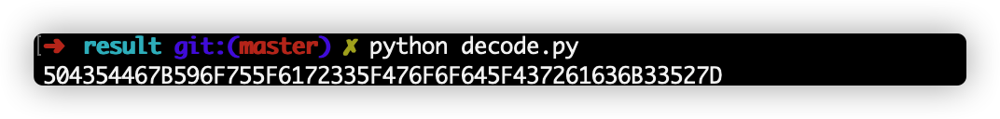
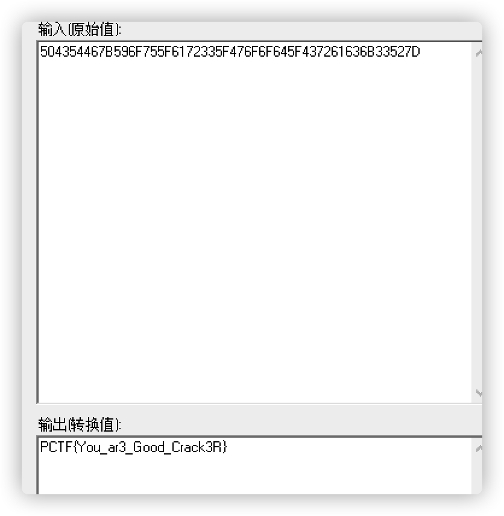

# baby'scrack

## 题目描述
---
既然是逆向题，我废话就不多说了，自己看着办吧。

flag格式：PCTF{flag}

> 附件：babyscrack.rar

## 题目来源
---
ichunqiu ISC2016训练赛——phrackCTF

## 主要知识点
---
逆向

## 题目分值
---
100

## 部署方式
---
无

## 解题思路
---
拿到代码后，可以看到清晰的加密方法。

```c
int __cdecl main(int argc, const char **argv, const char **envp)
{
  int result; // eax
  char Dest; // [rsp+20h] [rbp-80h]
  FILE *v5; // [rsp+88h] [rbp-18h]
  FILE *File; // [rsp+90h] [rbp-10h]
  char v7; // [rsp+9Fh] [rbp-1h]
  int v8; // [rsp+B0h] [rbp+10h]
  const char **v9; // [rsp+B8h] [rbp+18h]

  v8 = argc;
  v9 = argv;
  _main();
  if ( v8 <= 1 )
  {
    printf("Usage: %s [FileName]\n", *v9);
    printf(aFilename);
    exit(1);
  }
  File = fopen(v9[1], "rb+");
  if ( File )
  {
    v5 = fopen("tmp", "wb+");
    while ( feof(File) == 0 )
    {
      v7 = fgetc(File);
      // 加密方法
      if ( v7 != -1 && v7 )
      {
        if ( v7 > 47 && v7 <= 96 )
        {
          v7 += 53;
        }
        else if ( v7 <= 46 )
        {
          v7 += v7 % 11;
        }
        else
        {
          v7 = 61 * (v7 / 61);
        }
        fputc(v7, v5);
      }
    }
    fclose(v5);
    fclose(File);
    sprintf(&Dest, "del %s", v9[1]);
    system(&Dest);
    sprintf(&Dest, "ren tmp %s", v9[1]);
    system(&Dest);
    result = 0;
  }
  else
  {
    printf(&byte_40404B, v9[1]);
    result = -1;
  }
  return result;
}
```

写出相应的解密方法即可

```python
result = []
str = "jeihjiiklwjnk{ljj{kflghhj{ilk{k{kij{ihlgkfkhkwhhjgly"
for s in str:
    s_int = ord(s)
    if s_int > 100 and s_int <= 149:
        result.append(chr(s_int - 53))
    elif s_int <= 11:
        pass
    else:
        pass

result_str = "".join(result)
print result_str
```





PCTF{You_ar3_Good_Crack3R}