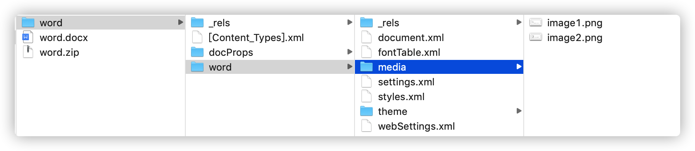
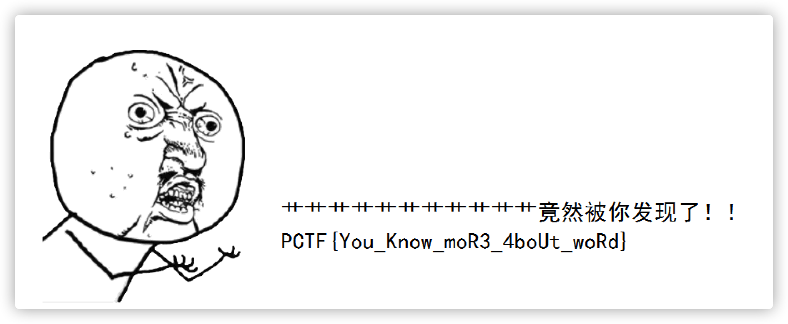

# 加密的文档

## 题目描述
---
出题人硬盘上找到一个神秘的压缩包，里面有个word文档

可是好像加密了呢~让我们一起分析一下吧！

> 文件: word.zip

flag格式:PCTF{flag}

## 题目来源
---
ichunqiu ISC2016训练赛——phrackCTF

## 主要知识点
---
word文档格式

## 题目分值
---
150

## 部署方式
---
无

## 解题思路
---
将word文档解压，发现两张照片，其中一张就是了。

PCTF{You_Know_moR3_4boUt_woRd}