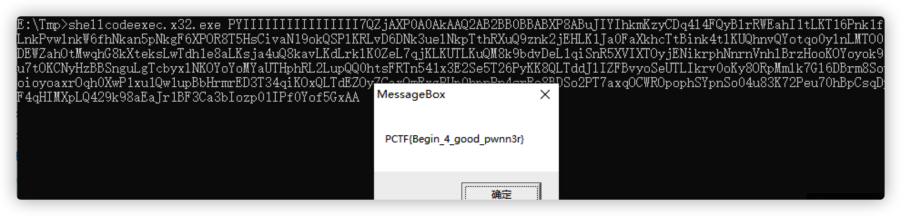

# shellcode

## 题目描述
---
作为一个黑客，怎么能不会使用shellcode?

这里给你一段shellcode，你能正确使用并最后得到flag吗？

> 文件：shellcode

flag格式：PCTF{flag}

## 题目来源
---
i春秋

## 主要知识点
---
shellcodeexec

## 题目分值
---
200

## 部署方式
---
无

## 解题思路
---

使用shellcodeexec执行即可获取flag[http://www.github.com/inquisb/shellcodeexec](http://www.github.com/inquisb/shellcodeexec)

PCTF{Begin_4_good_pwnn3r}

shellcodeexec的具体使用见下文
[https://www.kutu66.com/GitHub/article_129482](https://www.kutu66.com/GitHub/article_129482)

