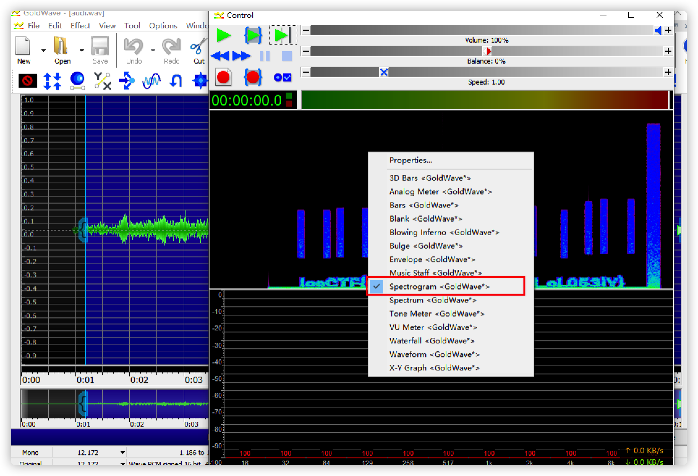
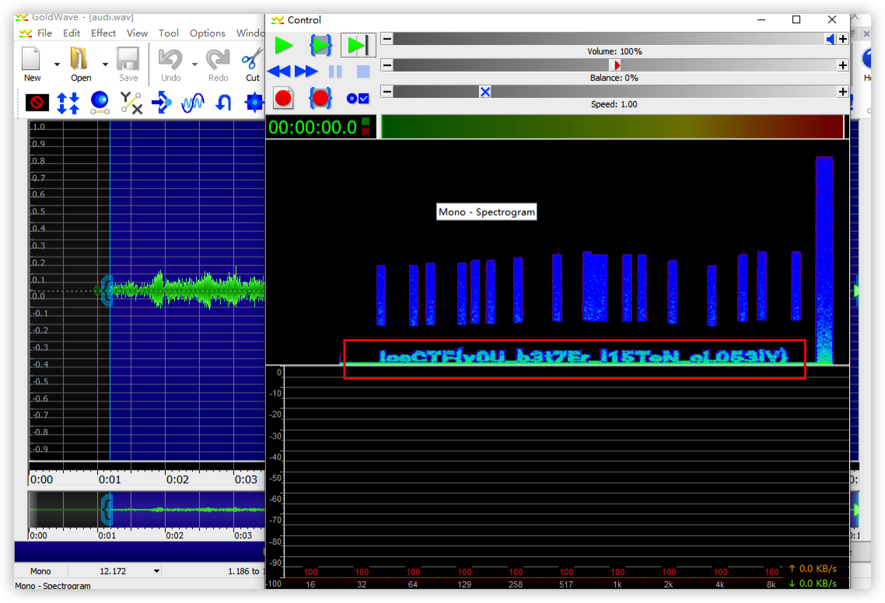
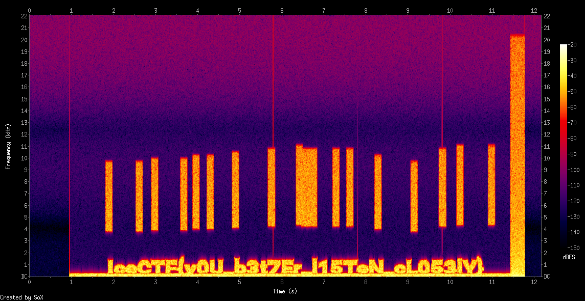

# Audio Problems

## 题目描述
---
We intercepted the audio signal it sounds like there could be something hidden in it. Can you take a look and see if you can find anything? 

我们截获了音频信号，听起来里面可能隐藏着什么。 你能看一下，看看你能找到什么吗？

> 附件：audi.wav

## 题目来源
---
i春秋

## 主要知识点
---
音谱图

## 题目分值
---
20

## 部署方式
---
无

## 解题思路
---

### 方法1

使用GoldWave软件打开音频，使用`控制`--`音谱图`



播放后产生下图



进行辨认即可

IceCTF{y0U_b3t7Er_l15TeN_cL053lY}

### 方法2

使用sox也可以得到音谱图

```bash
sox audi.wav -n spectrogram -z 130 -Z -20 -x 1000
```

