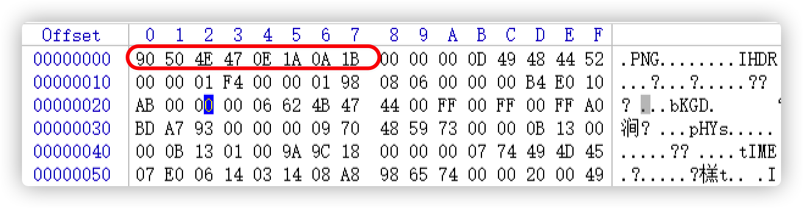
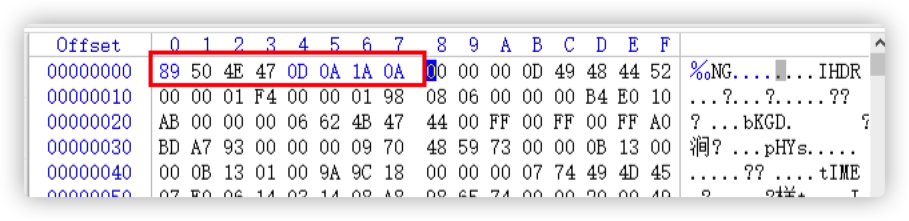
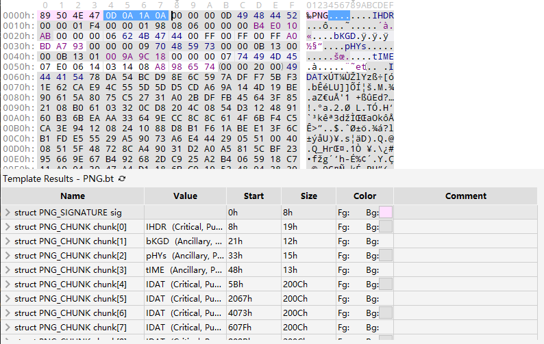

# Corrupt Transmission

## 题目描述
---
We intercepted this image, but it must have gotten corrupted during the transmission. Can you try and fix it? corrupt png

我们截获了这张图片，但它一定是在传输过程中损坏了。 你可以尝试修复它吗？

> corrupt_.png.crdownload

## 题目来源
---
ichunqiu IceCTF

## 主要知识点
---
修复png文件头

## 题目分值
---
30

## 部署方式
---
无

## 解题思路
---
使用winhex打开图片，找到PNG文件格式。

[https://blog.csdn.net/u013943420/article/details/76855416](https://blog.csdn.net/u013943420/article/details/76855416)

[https://dev.gameres.com/Program/Visual/Other/PNGFormat.htm](https://dev.gameres.com/Program/Visual/Other/PNGFormat.htm)

可以发这个图片文件头坏掉了

修改后

使用010Editor查看文件格式，已经正确

打开图片

ICeCTF{t1s_but_4_5cr4tch}

