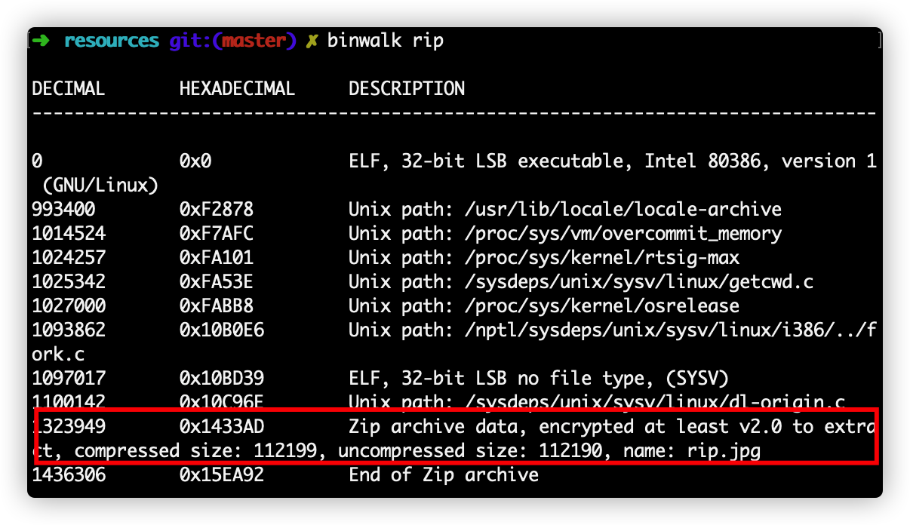
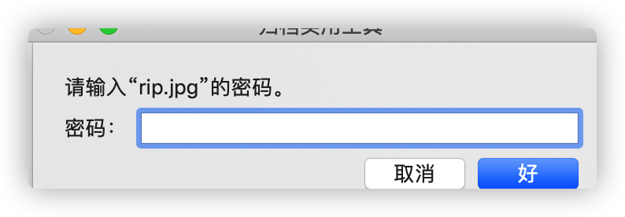
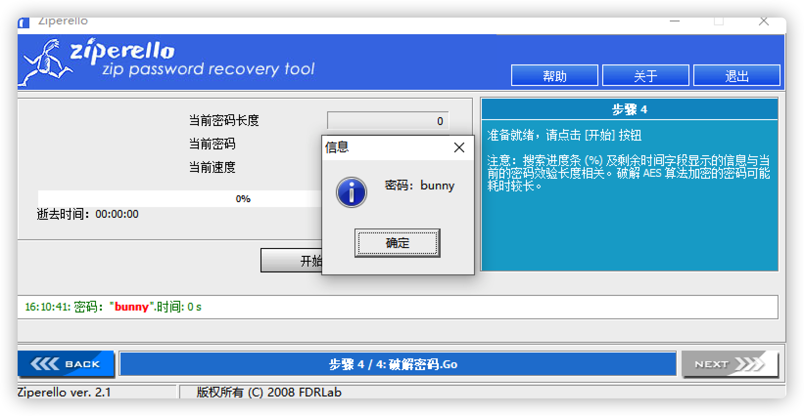
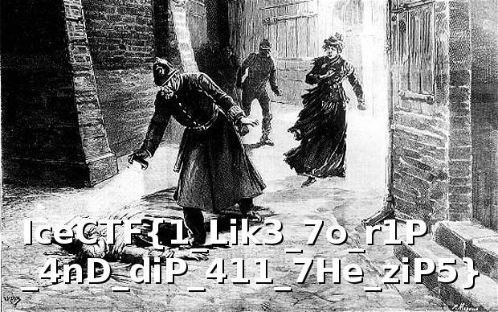

# R.I.P Transmission

## 题目描述
---
this seems to be recieving some sort of transmission. Our experts have been working around the clock trying and figure out what the hell it means with no hope of getting to the bottom of it. You're our only hope. 

这似乎正在接收某种传输。 我们的专家一直在夜以继日地工作，试图弄清楚这到底意味着什么，但没有希望深入了解。 你是我们唯一的希望。

>附件：rip

## 题目来源
---
ichunqiu IceCTF

## 主要知识点
---
附加文件 暴力破解

## 题目分值
---
40

## 部署方式
---
无

## 解题思路
---
使用`binwalk`查看文件后，发现里面有一个压缩包。

提取出文件 1433AD.zip 

解压需要密码，使用`Ziperello`进行zip压缩包解密。

解压获取图片，获得flag。

IceCTF{1_Lik3_7o_r1P_4nD_diP_411_7He_ziP5}