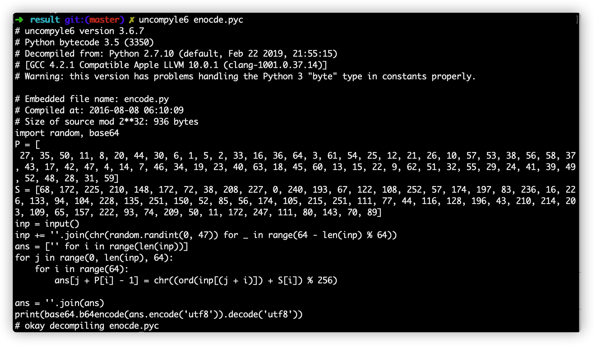

# Intercepted Conversations Pt.2 

## 题目描述
---
We managed to intercept more of the  hacker traffic unfortunately since our last encounter they have figured out that they're being watched. They've gotten more clever in their communication so we need you to try to make sense of this traffic. 

不幸的是，自从我们上次遇到黑客以来，我们设法拦截了更多的黑客流量，他们发现自己正在受到监视。 他们在交流方面变得更加聪明，所以我们需要你尝试理解这种流量。

## 题目来源
---
ichunqiu IceCTF

## 主要知识点
---
wireshark分析数据包，python反编译，写解码文件。

## 题目分值
---
50

## 部署方式
---


## 解题思路
---

整个流量包中只有者两组tcp包，其中第二个包是一个pyc文件


根据提示提取pyc文件，并反编译。



在第一张图内Cold_Storm发送了密文：`Wmkvw680HDzDqMK6UBXChDXCtC7CosKmw7R9w7JLwr/CoT44UcKNwp7DllpPwo3DtsOID8OPTcOWwrzDpi3CtMOKw4PColrCpXUYRhXChMK9w6PDhxfDicOdwoAgwpgNw5/Cvw==`。再过的了encode.py文件后，需要写出对应的解码文件。

```python
import base64

inp = base64.b64decode("Wmkvw680HDzDqMK6UBXChDXCtC7CosKmw7R9w7JLwr/CoT44UcKNwp7DllpPwo3DtsOID8OPTcOWwrzDpi3CtMOKw4PColrCpXUYRhXChMK9w6PDhxfDicOdwoAgwpgNw5/Cvw==").decode('utf8')
P = [
27, 35, 50, 11, 8, 20, 44, 30, 6, 1, 5, 2, 33, 16, 36, 64, 3, 61, 54, 25, 12, 21, 26, 10, 57, 53, 38, 56, 58, 37, 43, 17, 42, 47, 4, 14, 7, 46, 34, 19, 23, 40, 63, 18, 45, 60, 13, 15, 22, 9, 62, 51, 32, 55, 29, 24, 41, 39, 49, 52, 48, 28, 31, 59]
S = [68, 172, 225, 210, 148, 172, 72, 38, 208, 227, 0, 240, 193, 67, 122, 108, 252, 57, 174, 197, 83, 236, 16, 226, 133, 94, 104, 228, 135, 251, 150, 52, 85, 56, 174, 105, 215, 251, 111, 77, 44, 116, 128, 196, 43, 210, 214, 203, 109, 65, 157, 222, 93, 74, 209, 50, 11, 172, 247, 111, 80, 143, 70, 89]

ans = ['' for i in range(len(inp))]
for j in range(0, len(inp), 64):
    for i in range(64):
        x = ord(inp[j + P[i] - 1]) - S[i]
        if x < 0:
            x += 256
        ans[j + i] = chr(x)

ans = ''.join(ans)
print(ans)
```

运行后得到结果

IceCTF{4Lw4y5_US3_5s1_AnD_n3VR4r_mAKe_Y0ur_0wN_cRyp70}

## 参考
---


