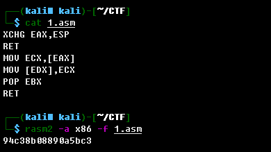

# ROPGadge

## 题目描述
---
都说学好汇编是学习PWN的基础，以下有一段ROPGadget的汇编指令序列，请提交其十六进制机器码(大写，不要有空格)

```x86asm
XCHG EAX,ESP
RET
MOV ECX,[EAX]
MOV [EDX],ECX
POP EBX
RET
```

提交格式：PCTF{你的答案}

## 题目来源
---
ichunqiu ISC2016训练赛——phrackCTF

## 主要知识点
---
汇编 机器码转化

## 题目分值
---


## 部署方式
---


## 解题思路
---
使用[radare2](https://github.com/radareorg/radare2/releases/)可以进行汇编转机器码，再kali下使用rasm2（radare2的辅助程序）：



PCTF{94C38B08890A5BC3}

## 参考
---
