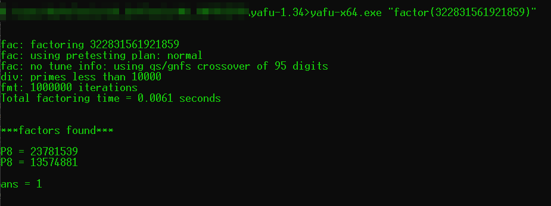
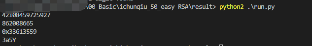

# easy RSA

## 题目描述
---
已知一段加密的信息为：0xdc2eeeb2782c，且已知加密所用的公钥：(N=322831561921859 e = 23)

请解密出明文，提交时请将数字转化成ascii码提交，比如你解出的明文是0x6162，请提交字符串ab

提交格式:PCTF{明文字符串}

## 题目来源
---
ichunqiu ISC2016训练赛——phrackCTF

## 主要知识点
---
rsa

## 题目分值
---
50

## 部署方式
---


## 解题思路
---
一直公钥和密文，且e是小值，所以需要先求出私钥，然后再解出明文

使用yafu进行大整数分解，yafu的使用方法如下。

> 使用 cmd 进入到 yafu 所在目录下，或将目录加入到系统环境 PATH 变量，或打开目录文件夹后 shift + 右键 选择在此处打开 powershell 。
> 假如要分解因数 6 ，输入命令：.\yafu-x64.exe "factor(6)"。
> 如果因数过长，将 因数 用文本文件存放在 yafu 目录下，例如：data.txt 。文件最后一行一定要换行，否则 eof; done processing batchfile。
> 运行命令：.\yafu-x64.exe "factor(@)" -batchfile data.txt



分解N得到P和Q为

```
P = 23781539
Q = 13574881
```

求私钥d

```python
import gmpy2
q = 23781539
p = 13574881
e = 23
c = 0xdc2eeeb2782c
n = 322831561921859
d = gmpy2.invert(e, (p-1)*(q-1))
print d
# m = pow(c,d,n)
m = gmpy2.powmod(c,d,n)
print m

import binascii
print str(hex(m))
print binascii.unhexlify(str(hex(m))[2:])
```



PCTF{3a5Y}

## 参考
---
