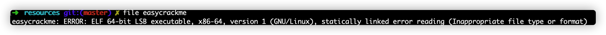
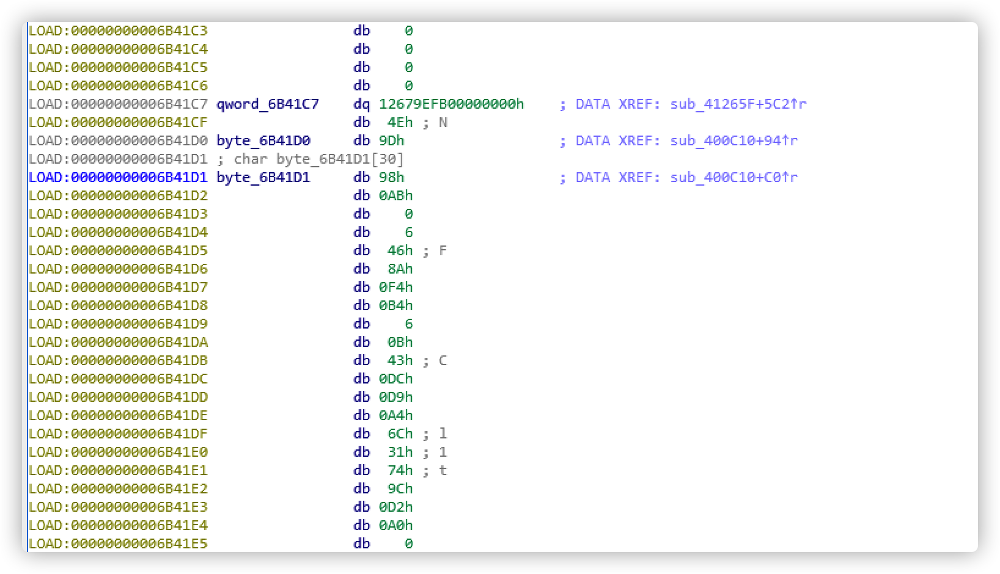

# easyCrackMe

## 题目描述
---
都说逆向挺难的，但是这题挺容易，反正我不会，大家来挑战一下吧~~:)

> 附件：easycrackme

## 题目来源
---
ichunqiu ISC2016训练赛——phrackCTF

## 主要知识点
---
循环异或加密

## 题目分值
---
50

## 部署方式
---
无

## 解题思路
---
查看文件类型是linux



使用IDA加载文件。找到关键代码
```c
__int64 sub_400C10()
{
  char v0; // dl
  __int64 v1; // rdi
  char v3; // [rsp+0h] [rbp-38h]
  char v4; // [rsp+1h] [rbp-37h]
  char v5; // [rsp+2h] [rbp-36h]
  char v6; // [rsp+3h] [rbp-35h]
  char v7; // [rsp+4h] [rbp-34h]
  char v8; // [rsp+5h] [rbp-33h]
  unsigned __int8 v9; // [rsp+10h] [rbp-28h]
  _BYTE v10[7]; // [rsp+11h] [rbp-27h]

  v3 = -85;
  v4 = -35;
  v5 = 51;
  v6 = 84;
  v7 = 53;
  v8 = -17;
  sub_407400((unsigned __int64)"nput your password:");
  sub_407530((unsigned __int64)"", (unsigned __int64)&v9, v0);
  if ( strlen((const char *)&v9) == 26 )
  {
    v1 = 0LL;
    if ( (v9 ^ 0xAB) == byte_6B41D0 )
    {
      while ( (v10[v1] ^ (unsigned __int8)*(&v3 + ((signed int)v1 + 1) % 6)) == byte_6B41D1[v1] )
      {
        if ( ++v1 == 25 )
        {
          sub_407400((unsigned __int64)"ongratulations!");
          return 0LL;
        }
      }
    }
  }
  sub_407400((unsigned __int64)"assword Wrong!! Please try again.");
  return 0LL;
}
```

可以看到是一个异或循环加密，找到`byte_6B41D1`的值进行解密，写出下面代码。



```python

import ctypes 

sox = [-85, -35, 51, 84, 53, -17]
hah = [0xfb, 0x9e, 0x67, 0x12, 0x4e, 0x9d, 0x98, 0xAB, 0x0, 0x6, 0x46, 0x8A, 0x0F4, 0x0B4, 0x6, 0x0B, 0x43, 0xDC, 0xD9, 0x0A4, 0x6C, 0x31, 0x74, 0x9C, 0xD2, 0xA0,]

result = []
for i in range(0,26):
    # print sox[i%6], ctypes.c_ubyte(sox[i%6]).value
    print chr(hah[i] ^ ctypes.c_ubyte(sox[i%6]).value)
    result.append(chr(hah[i] ^ ctypes.c_ubyte(sox[i%6]).value))

print "".join(result)

# PCTF{r3v3Rse_i5_v3ry_eAsy}
```
