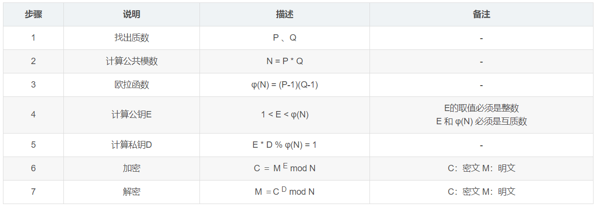
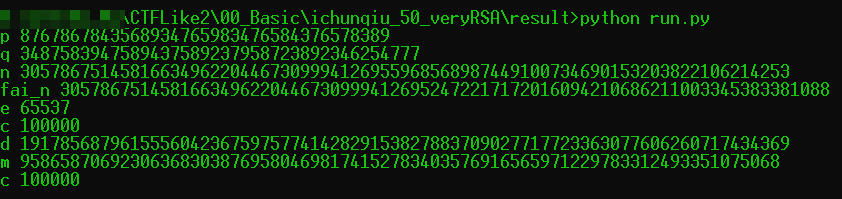
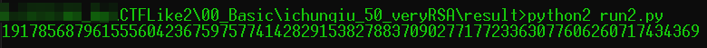

# veryRSA

## 题目描述
---
已知RSA公钥生成参数：

p = 3487583947589437589237958723892346254777 

q = 8767867843568934765983476584376578389

e = 65537

求d = 

请提交PCTF{d}

## 题目来源
---
ichunqiu ISC2016训练赛——phrackCTF

## 主要知识点
---
rsa

## 题目分值
---
50

## 部署方式
---
无

## 解题思路
---

简单的RSA计算，RSA算法见下链接。

[https://blog.csdn.net/jijianshuai/article/details/80582187](https://blog.csdn.net/jijianshuai/article/details/80582187)




### 方法1

```python
import math

q = 3487583947589437589237958723892346254777
p = 8767867843568934765983476584376578389
n = p * q
fai_n = (p-1)*(q-1)
e = 65537
c = 100000 

def egcd(a, b):
    if a == 0:
        return (b, 0, 1)
    else:
        g, y, x = egcd(b % a, a)
        return (g, x - (b // a) * y, y)

# (E*D)% fai(N) = 1
def calc_d(e, fai_n):
    g, x, y = egcd(e, fai_n)
    if g != 1:
        raise Exception('modular inverse does not exist')
    else:
        return x % fai_n

print "p", p 
print "q", q
print "n", n
print "fai_n", fai_n
print "e", e
print "c", c

d = calc_d(e, fai_n)
print "d", d

m = pow(c,d,n)
print "m", m

new_c = pow(m,e,n)
print "c", new_c
```



PCTF{19178568796155560423675975774142829153827883709027717723363077606260717434369}

### 方法2

```python
import gmpy2
q = 3487583947589437589237958723892346254777
p = 8767867843568934765983476584376578389
e = 65537
d = gmpy2.invert(e,(p-1)*(q-1))
print d
```

