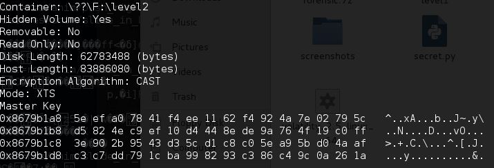

# 取证

## 题目描述
---
有一款取证神器如下图所示，可以从内存dump里分析出TureCrypt的密钥，你能找出这款软件的名字吗？名称请全部小写。

图片：
提交格式：PCTF{软件名字}

## 题目来源
---
ichunqiu ISC2016训练赛——phrackCTF

## 主要知识点
---
取证

## 题目分值
---

## 部署方式
---

## 解题思路
---

PCTF{volatility}

Volatility是一款开源内存取证框架，能够对导出的内存镜像进行分析，通过获取内核数据结构，使用插件获取内存的详细情况以及系统的运行状态。

## 参考
---
* https://github.com/volatilityfoundation/volatility
* https://blog.csdn.net/xlsj228/article/details/98876028
* https://cloud.tencent.com/developer/article/1562899
