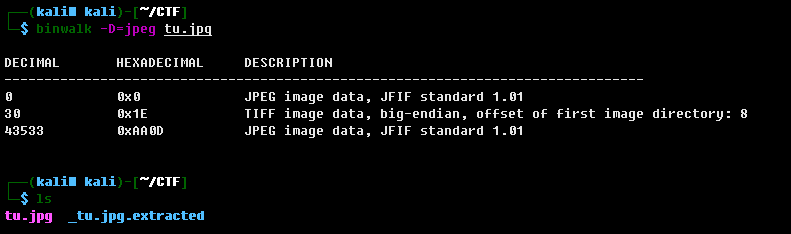
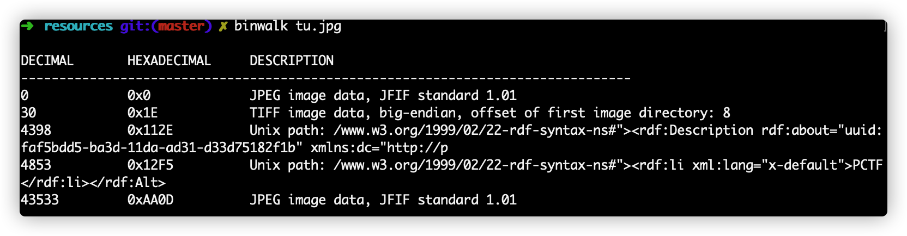
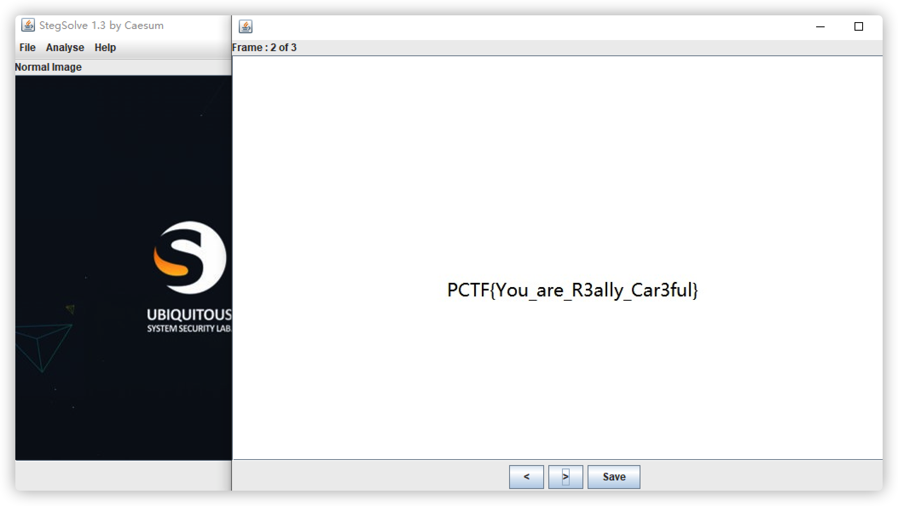

# 实验室logo

## 题目描述
---
出题人丢下个logo就走了，大家自己看着办吧

## 题目来源
---
ichunqiu ISC2016训练赛——phrackCTF

## 主要知识点
---

## 题目分值
---
50

## 部署方式
---

## 解题思路
---

### 第一种解法

使用binwalk识别图片，发现图片中还隐藏了一个JPEG图片

打开图片即可查看到flag

PCTF{You_are_R3ally_Car3ful}

### 第二种解法

使用binwalk查看文件，发现是一个gif图片。

使用Stegsolve.jar打开文件，查看帧，第二帧发现flag。

PCTF{You_are_R3ally_Car3ful}

## 参考
---
