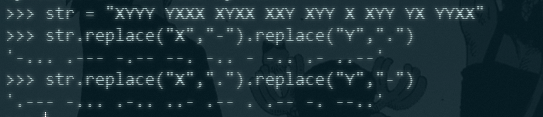
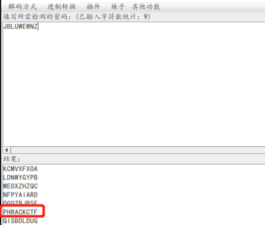

# 熟悉的声音

## 题目描述
---
两种不同的元素，如果是声音的话，听起来是不是很熟悉呢，

据说前不久神盾局某位特工领便当了大家都很惋惜哦

XYYY YXXX XYXX XXY XYY X XYY YX YYXX

请提交PCTF{你的答案}

## 题目来源
---
ichunqiu ISC2016训练赛——phrackCTF

## 主要知识点
---
摩斯密码 凯撒加密

## 题目分值
---
60

## 部署方式
---

## 解题思路
---
看起来像摩斯密码，替换试一试

将X替换为-，将Y替换为.，`-... .--- -.-- --. -.. - -.. .- ..--`

将X替换为.，将Y替换为-，`.--- -... .-.. ..- .-- . .-- -. --..`

使用[CTFCrackTools](https://github.com/Acmesec/CTFCrackTools)进行解密

只能得到一个值`JBLUWEWNZ`

测试凯撒密码

PCTF{PHRACKCTF}

## 参考
---
