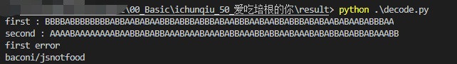

# 爱吃培根的你

## 题目描述
---
听说你也喜欢吃培根？那我们一起来欣赏一段培根的介绍吧：

bacoN is one of aMerICa'S sWEethEartS. it's A dARlinG, SuCCulEnt fOoD tHAt PaIRs FlawLE

什么，不知道要干什么？上面这段巨丑无比的文字，为什么会有大小写呢？你能发现其中的玄机吗？

提交格式：PCTF{你发现的玄机}

## 题目来源
---
ichunqiu ISC2016训练赛——phrackCTF

## 主要知识点
---
培根密码

## 题目分值
---
50

## 部署方式
---


## 解题思路
---

题目提示为培根 所以猜测是培根密码，将大写字母转换为B,小写字母转换为A

写代码转化并解码

```python
dicc = {'AAAAA':'a','AAAAB':'b','AAABA':'c','AAABB':'d','AABAA':'e','AABAB':'f',
        'AABBA':'g','AABBB':'h','ABAAA':'i/j','ABAAB':'k','ABABA':'l','ABABB':'m',
        'ABBAA':'n','ABBAB':'o','ABBBA':'p','ABBBB':'q','BAAAA':'r','BAAAB':'s',
        'BAABA':'t','BAABB':'u/v','BABAA':'w','BABAB':'x','BABBA':'y','BABBB':'z'}
init = "bacoN is one of aMerICa'S sWEethEartS. it's A dARlinG, SuCCulEnt fOoD tHAt PaIRs FlawLE"
init = init.replace(' ','').replace('.','').replace(',','').replace("'",'')
l = len(init)
assert l%5 == 0
ans1=''
ans2=''
ans3 = []
ans4 = []
for i in init:
    if i.isupper():
        ans1 += 'A'
        ans2 += 'B'
    else:
        ans1 += 'B'
        ans2 += 'A'
for i in range(l//5):
    ans3 .append(ans1[i*5:i*5+5])
    ans4 .append(ans2[i*5:i*5+5])
print("first : " + ans1)
print("second : " + ans2)

try:
    for i in range(len(ans3)):
        ans3[i] = dicc[ans3[i]]
    print(''.join(ans3))
except:
    print("first error")
    
try:
    for i in range(len(ans4)):
        ans4[i] = dicc[ans4[i]]
    print(''.join(ans4))
except:
    print("second error")
```



PCTF{baconijsnotfood}

## 参考
---
