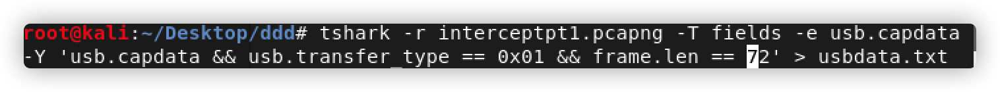

# Intercepted Conversations Pt.1 

## 题目描述
---
This traffic was picked up by one of our agents. We think this might be a conversation between two elite hackers that we are investigating. Can you see if you can analyze the data? intercept.pcapng

此流量由我们的一位代理接收。 我们认为这可能是我们正在调查的两名精英黑客之间的对话。 你看看你能不能分析数据？

## 题目来源
---
ichunqiu IceCTF

## 主要知识点
---
USB数据包 Dvorak键盘

## 题目分值
---
60

## 部署方式
---


## 解题思路
---
Wireshark查看证实是usb通信的数据包，使用tshark获取usb数据包的内容。
```
tshark -r interceptpt1.pcapng -T fields -e usb.capdata -Y 'usb.capdata && usb.transfer_type == 0x01 && frame.len == 72' > usbdata.txt
```


得到数据
```00:00:00:00:00:00:00:00
00:00:00:00:00:00:00:00
20:00:00:00:00:00:00:00
20:00:0a:00:00:00:00:00
20:00:00:00:00:00:00:00
00:00:00:00:00:00:00:00
00:00:0c:00:00:00:00:00
00:00:00:00:00:00:00:00
00:00:07:00:00:00:00:00
00:00:00:00:00:00:00:00
02:00:00:00:00:00:00:00
02:00:0c:00:00:00:00:00
02:00:00:00:00:00:00:00
02:00:0e:00:00:00:00:00
02:00:00:00:00:00:00:00
02:00:1c:00:00:00:00:00
02:00:00:00:00:00:00:00
00:00:00:00:00:00:00:00
02:00:00:00:00:00:00:00
02:00:2f:00:00:00:00:00
02:00:00:00:00:00:00:00
00:00:00:00:00:00:00:00
02:00:00:00:00:00:00:00
02:00:36:00:00:00:00:00
02:00:00:00:00:00:00:00
00:00:00:00:00:00:00:00
00:00:0d:00:00:00:00:00
00:00:00:00:00:00:00:00
00:00:27:00:00:00:00:00
00:00:00:00:00:00:00:00
02:00:00:00:00:00:00:00
02:00:2d:00:00:00:00:00
02:00:00:00:00:00:00:00
00:00:00:00:00:00:00:00
00:00:13:00:00:00:00:00
00:00:00:00:00:00:00:00
00:00:1e:00:00:00:00:00
00:00:00:00:00:00:00:00
20:00:00:00:00:00:00:00
20:00:19:00:00:00:00:00
20:00:00:00:00:00:00:00
00:00:00:00:00:00:00:00
00:00:20:00:00:00:00:00
00:00:00:00:00:00:00:00
02:00:00:00:00:00:00:00
02:00:33:00:00:00:00:00
02:00:00:00:00:00:00:00
02:00:2d:00:00:00:00:00
02:00:00:00:00:00:00:00
00:00:00:00:00:00:00:00
00:00:1b:00:00:00:00:00
00:00:00:00:00:00:00:00
00:00:36:00:00:00:00:00
00:00:00:00:00:00:00:00
00:00:20:00:00:00:00:00
00:00:00:00:00:00:00:00
02:00:00:00:00:00:00:00
02:00:12:00:00:00:00:00
02:00:00:00:00:00:00:00
00:00:00:00:00:00:00:00
00:00:24:00:00:00:00:00
00:00:00:00:00:00:00:00
20:00:00:00:00:00:00:00
20:00:17:00:00:00:00:00
20:00:00:00:00:00:00:00
00:00:00:00:00:00:00:00
02:00:00:00:00:00:00:00
02:00:2d:00:00:00:00:00
02:00:00:00:00:00:00:00
00:00:00:00:00:00:00:00
00:00:21:00:00:00:00:00
00:00:00:00:00:00:00:00
02:00:00:00:00:00:00:00
02:00:0f:00:00:00:00:00
02:00:00:00:00:00:00:00
02:00:17:00:00:00:00:00
02:00:00:00:00:00:00:00
00:00:00:00:00:00:00:00
00:00:36:00:00:00:00:00
00:00:00:00:00:00:00:00
00:00:21:00:00:00:00:00
00:00:00:00:00:00:00:00
00:00:17:00:00:00:00:00
00:00:00:00:00:00:00:00
00:00:22:00:00:00:00:00
00:00:00:00:00:00:00:00
02:00:00:00:00:00:00:00
02:00:30:00:00:00:00:00
02:00:00:00:00:00:00:00
00:00:00:00:00:00:00:00
```

使用脚本获取真实的按键内容，此键盘为Dvorak键盘，和常见的键盘不一致。

```python
# Dvorak键盘，它的字母排列和我们常用的键盘不同，只要在根据转化表转换即可
hids_codes = {"0x04":"a","0x05":"b","0x06":"c","0x07":"d","0x08":"e","0x09":"f","0x0A":"g","0x0B":"h","0x0C":"i","0x0D":"j","0x0E":"k","0x0F":"l","0x10":"m","0x11":"n","0x12":"o","0x13":"p","0x14":"q","0x15":"r","0x16":"s","0x17":"t","0x18":"u","0x19":"v","0x1A":"w","0x1B":"x","0x1C":"y","0x1D":"z","0x1E":"1","0x1F":"2","0x20":"3","0x21":"4","0x22":"5","0x23":"6","0x24":"7","0x25":"8","0x26":"9","0x27":"0","0x36":",","0x33":":","0x28":"\n","0x2C":" ","0x2D":"_","0x2E":"=","0x2F":"{","0x30":"}"}
layout_dvorak = { 'q':"'", 'w':',', 'e':'.', 'r':'p', 't':'y', 'y':'f', 'u':'g', 'i':'c', 'o':'r', 'p':'l', '_':'_', ':':'S','[':'/', '{':'{', '}':'}' ,']':'=','a':'a', 's':'o', 'd':'e', 'f':'u', 'g':'i', 'h':'d', 'j':'h', 'k':'t', 'l':'n', ';':'s', "'":'-','z':';', 'x':'q', 'c':'j', 'v':'k', 'b':'x', 'n':'b', 'm':'m', ',':'w', '.':'v', '.':'z',' ':' ','Q':"'", 'W':',', 'E':'.', 'R':'P', 'T':'Y', 'Y':'F', 'U':'G', 'I':'C', 'O':'R', 'P':'L','A':'A', 'S':'O', 'D':'E', 'F':'U', 'G':'I', 'H':'D', 'J':'H', 'K':'T', 'L':'N', ';':'S', "'":'-','Z':';', 'X':'Q', 'C':'J', 'V':'K', 'B':'X', 'N':'B', 'M':'M','0':'0','1':'1','2':'2','3':'3','4':'4','5':'5','6':'6','7':'7','7':'7','8':'8','9':'9'}
flag = ''
file = open('usbdata.txt','r') 
for line in file.readlines():
    spli = line.split(':')
    conv = '0x'+spli[2].upper()
    if conv in hids_codes:
        if spli[0] == '00':
            flag += layout_dvorak[hids_codes[conv]]
        else:
            flag += layout_dvorak[hids_codes[conv].upper()]

print(flag)
#output IceCTF{wh0_l1K3S_qw3R7Y_4NYw4y5}
```

## 参考
---


