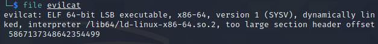
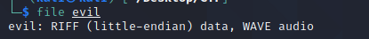
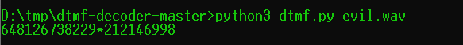
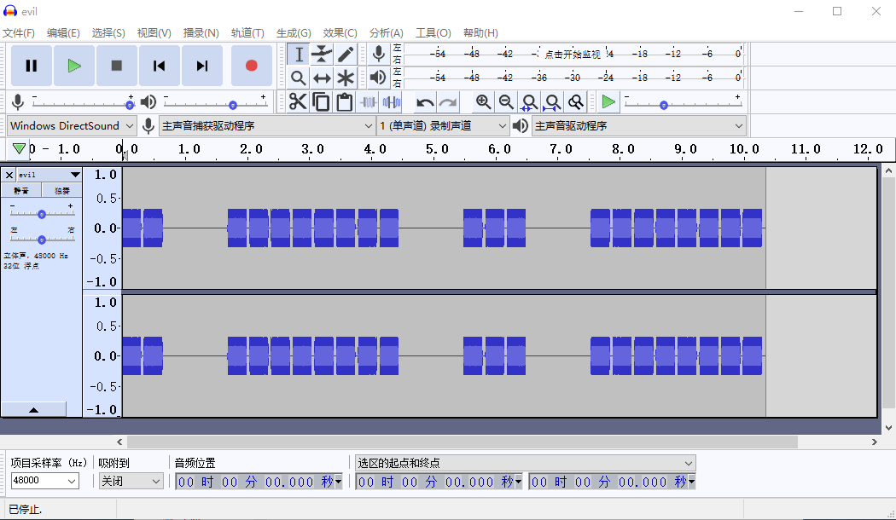
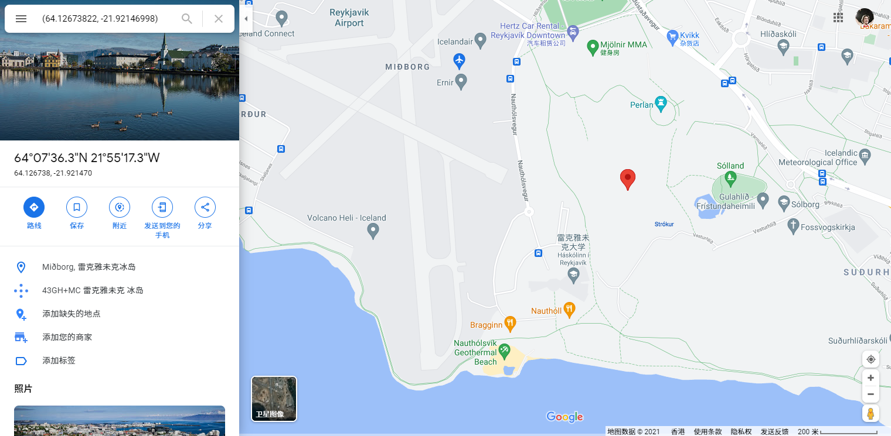

# Root of All Evil  

## 题目描述
---
Oh no! Dr.Evil managed to get into one of ours servers, we don't know what he did. I took an image of the file system, can you take a look and see what he left behind? Note to Foreign teams: Please make a ticket when you solve Root of All Evil and make sure you include proof. 

哦，不！邪恶博士设法进入了我们的服务器，我们不知道他做了什么。我拍了一张文件系统的照片，你能看看他留下了什么吗？外国代表队注意：解决万恶之源时，请出示罚单，并确保提供证据。

## 题目来源
---
ichunqiu IceCTF

## 主要知识点
---


## 题目分值
---
70

## 部署方式
---


## 解题思路
---
在bin目录下发现文件`evilcat`



在文件中发现超长字符串，使用命令导出，并使用base64对这个字符串解码

```bash
strings evilcat | egrep '[A-Za-z0-9+/]{300,}' | base64 -d > evil
```

发现是一个`RIFF (little-endian) data, WAVE audio`音频文件



音频文件内是DTMF的音调，需要进行解码。

> 双音多频信号( DTMF ) 是一种电信信号系统，在电话设备与其他通信设备和交换中心之间的电话线上使用语音频带。DTMF首先在发达贝尔系统在美国和商标出名按键音在使用按键电话提供给电话用户，开始于1963年DTMF被标准化为ITU-T建议Q .23. 它在英国也被称为MF4。

使用https://github.com/ribt/dtmf-decoder项目进行解码



得到`648126738229*212146998`

使用`Audacity`或者`GoldWave`可以看到音波图



根据空格的信息可以得到最后的信息为`64 12673822 *21 2146998`，这里可以根据音波图发现识别出来的内容不太正确，经过互联网查询，正确的值应该为`64 12673822 *21 92146998`，这是一个坐标，具体地点在



我们当然是找不到真正的flag了，给出实际的。

IceCTF{what_am_i_doing_1n_the_w00ds_s3nd_h4lp}

## 参考
---
* [一个DTMT的生成站点](https://onlinetonegenerator.com/dtmf.html)
* [另一个DTMT的生成站点](https://www.venea.net/web/dtmf_generator)
* https://github.com/cleversonahum/dtmf-generator
* https://chrisissing.wordpress.com/2016/08/24/icectf-root-of-all-evil-write-up/
* https://0x90r00t.com/2016/08/26/icectf-2016-forensics-150-root-of-all-evil-write-up/
* https://github.com/73696e65/ctf-notes/blob/master/2016-IceCTF/Root_of_All_Evil-Forensics-150.txt

