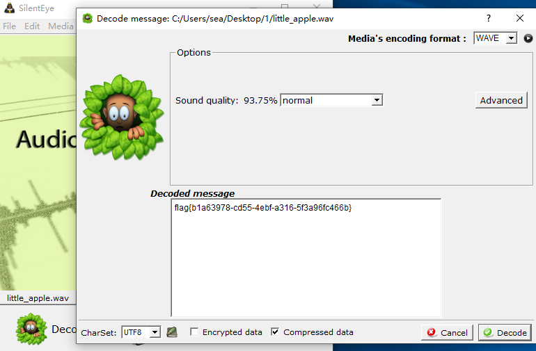

# 小苹果

## 题目描述
---
仔细听，听到就给你Down

> 附件 down.zip

## 题目来源
---
ichunqiu 2015广州强网杯

## 主要知识点
---
音频隐写

## 题目分值
---
80

## 部署方式
---

## 解题思路
---
使用音频隐写工具[silenteye](https://github.com/achorein/silenteye)进行解码

flag{b1a63978-cd55-4ebf-a316-5f3a96fc466b}

## 参考
---
