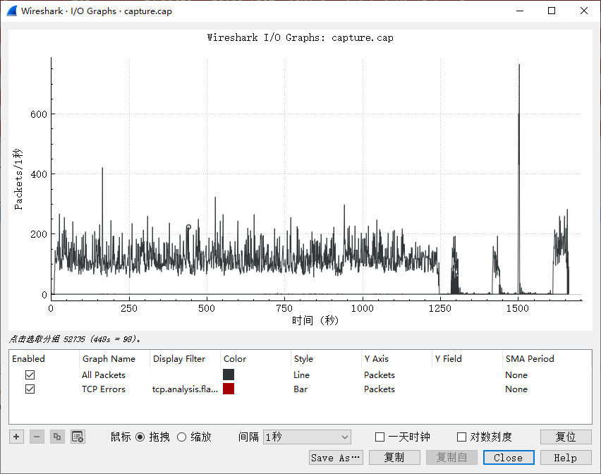
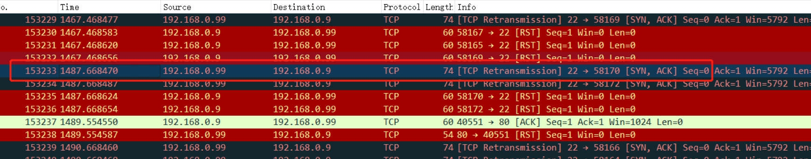
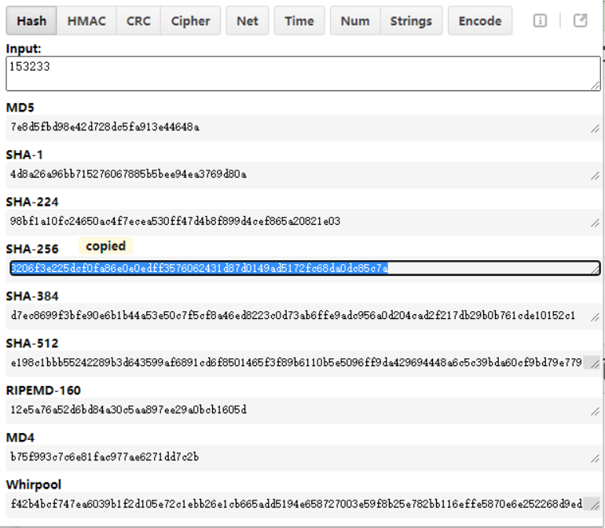

# SCAN

## 题目描述
---
```
有人在内网发起了大量扫描，而且扫描次数不止一次，请你从

capture日志分析一下对方第4次发起扫描是什么时候开始的，

请提交你发现包编号的sha256值(小写)。

文件：SCAN.rar

FLAG：PCTF{包编号的sha256值}
```

## 题目来源
---
ISC2016训练赛——phrackCTF

## 主要知识点
---


## 题目分值
---
100

## 部署方式
---


## 解题思路
---

粗略浏览数据包后，发现全部是SYN扫描报文，通过wireshark的统计IO功能，可以很容易找到第四次扫描





包编号153233的sha256值`3206f3e225dcf0fa86e0e0edff3576062431d87d0149ad5172fc68da0dc85c7a`



---

可以，答案不对，截取一个其他人的答案

隔壁写的根本无法自圆其说，评论询问也避实就虚，只能另开一帖。（换了几个浏览器都无法上传图片，只能写的详细些）

首先，wireshark统计->会话，可以看到除了99目标机器外，涉及1，254,9,199四个IP，其中1和254不需要关心。主要集中在9和199上。

9的流量明显最大，开始就应该将攻击目标集中在9上，但是这里看上去有9和199两台机器，但是其实两台是一台机器！！！

一方面统计中只有2个Mac地址，一个是99目标机器的，另一个自然是攻击机器的。点开9和199的数据包，可以查看到两者的mac地址是一致的。

明确这一观点后，我们再看统计->协议，发现数据包协议主要集中在TCP及ICMP协议上，TCP数据量大，ICMP数据量少容易分析。

再回头看整个数据包，开始9对目标机器99的攻击，可以发现是以ICMP探测开始，以TCP扫描作为后续的。

所以综上所述，我们只需要看ICMP协议的数据，就可以了解攻击机器发起了几次攻击、开始时间是何时。

前三次对99目标机的攻击都是由9发起的，到第四次变成了199，序号分别为：

192.168.0.9发起第1次攻击数据包序号：1

192.168.0.9第2次攻击数据包序号：148007

192.168.0.9第3次攻击数据包序号：150753

192.168.0.199第4次攻击数据包序号：155989

sha256(155989) = 0be2407512cc2a40bfb570464757fd56cd0a1d33f0bf3824dfed4f0119133c12

## 参考
---
