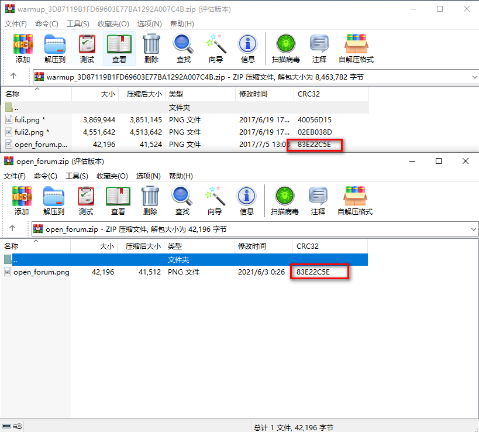
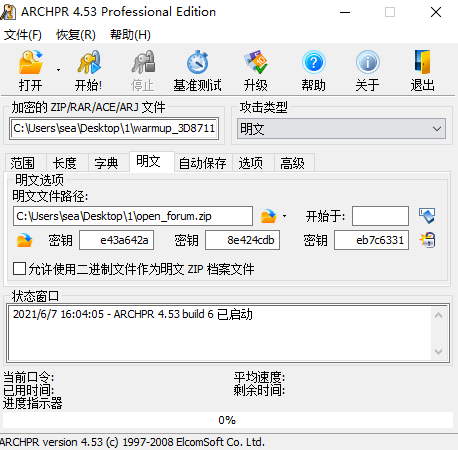
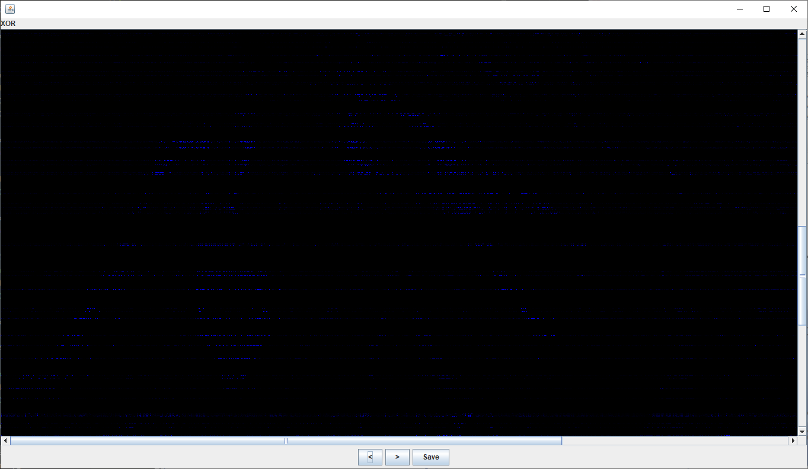

# Warmup

## 题目描述
---
```
Download

open_forum.png
```

## 题目来源
---
2017年全国大学生信息安全竞赛

## 主要知识点
---


## 题目分值
---


## 部署方式
---


## 解题思路
---

查看题目，给出了压缩包中的一个图片，使用winrar压缩比较两个压缩包中的CRC值，发现一样，所以使用明文攻击。



解密成功



```
Advanced Archive Password Recovery 统计信息:
加密的 ZIP/RAR/ACE/ARJ 文件: C:\Users\sea\Desktop\1\warmup_3D87119B1FD69603E77BA1292A007C4B.zip
总计口令: n/a
总计时间: 14s 279ms 
平均速度(口令/秒): n/a
这个文件的口令 : 未找到
加密密钥: [ e43a642a 8e424cdb eb7c6331 ]
```

破解成功后得到UnEncrypted文件夹，里面有fuli.png、fuli2.png，打开发现两张图片基本一样，使用stegsolve进行Xor运算， 打开图片fuli.png，点击Analyse->image combiner,发现有横纹，推断是使用了盲水印隐写。



那么用盲水印在，https://github.com/chishaxie/BlindWaterMark。执行以下命令： 

```
python bwm.py decode fuli.png fuli2.png out.png
```

得到flag图片如下


flag{bWm_Are_W0nderfu1}


## 参考
---
