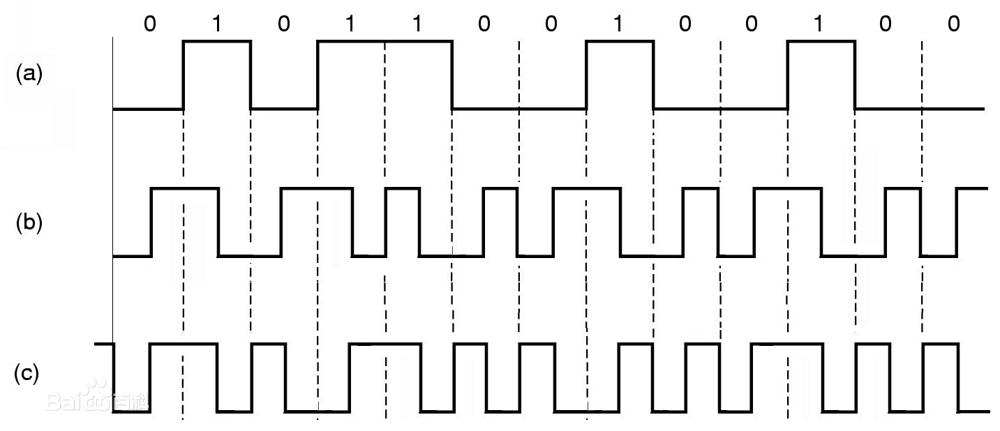

# 传感器1

## 题目描述
---
```
5555555595555A65556AA696AA6666666955

这是某压力传感器无线数据包解调后但未解码的报文(hex)


已知其ID为0xFED31F，请继续将报文完整解码，提交hex。

tips：flag是flag{破译出的明文}

提示1：曼联
```

## 题目来源
---
2016全国大学生信息安全竞赛

## 主要知识点
---
差分曼彻斯特编码

## 题目分值
---
100

## 部署方式
---


## 解题思路
---

数字信号编码是要解决数字数据的数字信号表示问题，即通过对数字信号进行编码来表示数据。数字信号编码的工作一般由硬件完成，常用的编码方法有以下三种：`不归零码`、`曼彻斯特编码`、`差分曼彻斯特编码`。

差分曼彻斯特编码是一种使用中位转变来计时的编码方案。数据通过在数据位开始处加一转变来表示。令牌环局域网就利用差分曼彻斯特编码方案。差分曼彻斯特编码在 每个时钟周期的中间都有一次电平跳变，这个跳变做同步之用。 在每个时钟周期的起始处：跳变则说明该比特是0，不跳变则说明该比特是1。

差分曼彻斯特编码的优点为：收发双方可以根据编码自带的时钟信号来保持同步，无需专门传递同步信号的线路，因此成本低；缺点为：实现技术复杂。

在信号位开始时改变信号极性，表示逻辑"0"；在信号位开始时不改变信号极性，表示逻辑"1"。如图所示。



其中：a）为不归零码，b）为曼彻斯特码，又叫数字双相码。c）为差分曼彻斯特码，又叫条件双相码（CDP码）。它是改进型的曼彻斯特编码，其特点是在每一位周期的中间，波形都有变化，如果在两位周期交界处电平没有变化，则表示“1”：有变化，则表示“0”（在信号位中间总是将信号反相；在信号位开始时不改变信号极性，表示逻辑“1”：在信号位开始时改变信号极性，表示逻辑“0”）。

识别差分曼彻斯特编码的方法：主要看两个相邻的波形，如果后一个波形和前一个的波形相同，则后一个波形表示0，如果波形不同，则表示1。

根据提示，为差分曼彻斯特编码，编写脚本，运行即可：

```python
#!/user/bin/env python2
# -*-coding:utf-8 -*-

n = 0x5555555595555A65556AA696AA6666666955
flag = ''
bs = '0'+bin(n)[2:]
r = ''

def conv(s):
    return hex(int(s, 2))[2:]

for i in range(0, len(bs), 2):
    if bs[i:i+2] == '01':
        r += '1'
    else:
        r += '0'

for i in range(0, len(r), 8):
    tmp = r[i:i+8][::-1]
    flag += conv(tmp[:4])
    flag += conv(tmp[4:])

print flag.upper()
```

FFFFFED31F645055F9

## 参考
---
