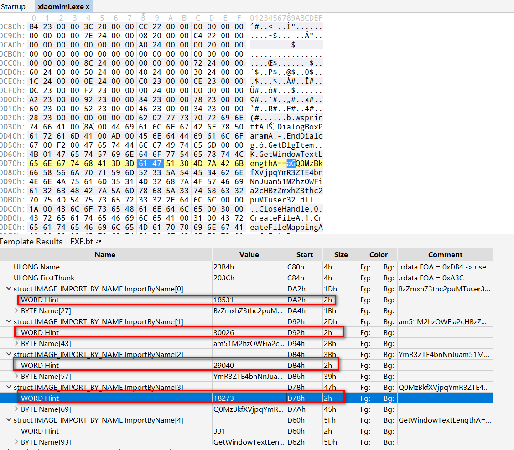
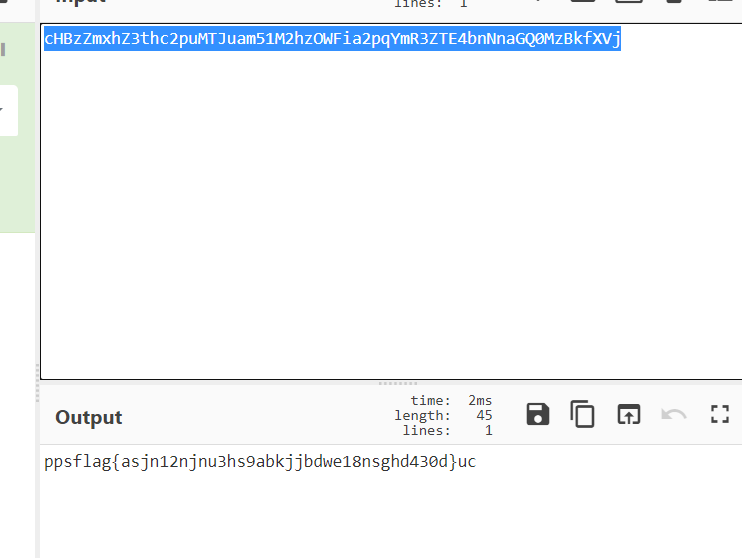

# 导入表的小秘密

## 题目描述
---
```
附件
```

## 题目来源
---
第三届“百越杯”福建省高校网络空间安全大赛

## 主要知识点
---


## 题目分值
---
100

## 部署方式
---


## 解题思路
---

做了很多方式都没有对，最后使用`010 ediotr`查看PE结构是才发现真正的方法

红框内的导入表`WORD HINT`信息要归属于后面`NAME`内容，以这样的形式进行拆分



使用如下方法将导入表中形如base64的代码进行拆分

```
BzZmxhZ3thc2puMT user32.dll
am51M2hzOWFia2 cHBzZmxhZ3thc2puMT user32.dll
YmR3ZTE4bnNn Juam51M2hzOWFia2 cHBzZmxhZ3thc2puMT user32.dll
aGQ0MzBkfXVj pqYmR3ZTE4bnNn Juam51M2hzOWFia2 cHBzZmxhZ3thc2puMT user32.dll
```

在使用分块倒序拼接如如下字符串

```
cHBzZmxhZ3thc2puMTJuam51M2hzOWFia2pqYmR3ZTE4bnNnaGQ0MzBkfXVj

```

解码后结果



```
ppsflag{asjn12njnu3hs9abkjjbdwe18nsghd430d}uc
```

## 参考
---
