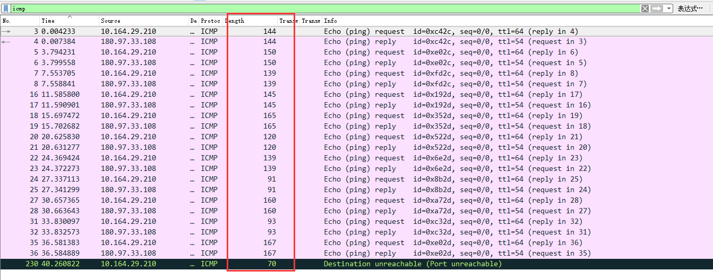
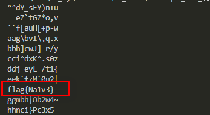

# 要想会，先学会

## 题目描述
---
```
附件
```

## 题目来源
---
第三届“百越杯”福建省高校网络空间安全大赛

## 主要知识点
---
icmp 轮转凯撒

## 题目分值
---
100

## 部署方式
---


## 解题思路
---

官方提示ping，在流量包文件中找icmp协议



```python
#!/usr/bin/env python2
# -*- coding: utf-8 -*-
a=[144,144,150,139,145,165,120,139,91,160,93,167,70]
for j in range(-50,50):
  flag=''
  for i in a:
    flag+=chr(i+j)
  print flag
```
按照时间排序，得到一串奇怪的东西，转ascii有很多字符不可见，猜测是有一些偏移，于是写了个py脚本暴力所以可能的偏移，得到flag



flag{Na1v3}

## 参考
---
