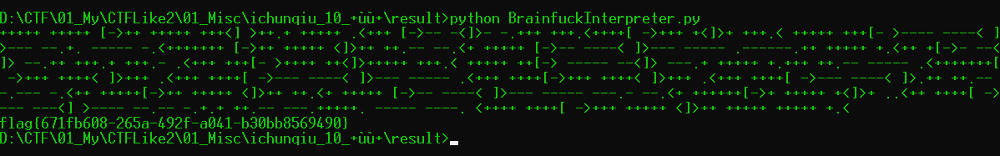

# +——+

## 题目描述
---
```
+++++ +++++ [->++ +++++ +++<] >++.+ +++++ .<+++ [->-- -<]>- -.+++ +++.<
++++[ ->+++ +<]>+ +++.< +++++ +++[- >---- ----< ]>--- --.+. ----- -.<++
+++++ [->++ +++++ <]>++ ++.-- --.<+ +++++ [->-- ----< ]>--- ----- .----
--.++ +++++ +.<++ +[->- --<]> --.++ +++.+ +++.- .<+++ +++[- >++++ ++<]>
+++++ +++.< +++++ ++[-> ----- --<]> ---.+ +++++ +.+++ ++.-- ----- .<+++
++++[ ->+++ ++++< ]>+++ .<+++ ++++[ ->--- ----< ]>--- ----- .<+++ ++++[
->+++ ++++< ]>+++ .<+++ ++++[ ->--- ----< ]>.++ ++.-- -.--- -.<++ +++++
[->++ +++++ <]>++ ++.<+ +++++ [->-- ----< ]>--- ----- ---.- --.<+ +++++
+[->+ +++++ +<]>+ ..<++ ++++[ ->--- ---<] >---- --.-- -.+.+ ++.-- ---.+
++++. ----- ----. <++++ ++++[ ->+++ +++++ <]>++ +++++ +++++ +.<
```

## 题目来源
---
“百度杯”CTF比赛 十二月场

## 主要知识点
---
brainfuck

## 题目分值
---
10

## 部署方式
---


## 解题思路
---

```
+++++ +++++ [->++ +++++ +++<] >++.+ +++++ .<+++ [->-- -<]>- -.+++ +++.<++++[ ->+++ +<]>+ +++.< +++++ +++[- >---- ----< ]>--- --.+. ----- -.<+++++++ [->++ +++++ <]>++ ++.-- --.<+ +++++ [->-- ----< ]>--- ----- .------.++ +++++ +.<++ +[->- --<]> --.++ +++.+ +++.- .<+++ +++[- >++++ ++<]>+++++ +++.< +++++ ++[-> ----- --<]> ---.+ +++++ +.+++ ++.-- ----- .<+++++++[ ->+++ ++++< ]>+++ .<+++ ++++[ ->--- ----< ]>--- ----- .<+++ ++++[->+++ ++++< ]>+++ .<+++ ++++[ ->--- ----< ]>.++ ++.-- -.--- -.<++ +++++[->++ +++++ <]>++ ++.<+ +++++ [->-- ----< ]>--- ----- ---.- --.<+ ++++++[->+ +++++ +<]>+ ..<++ ++++[ ->--- ---<] >---- --.-- -.+.+ ++.-- ---.+++++. ----- ----. <++++ ++++[ ->+++ +++++ <]>++ +++++ +++++ +.<
```



flag{671fb608-265a-492f-a041-b30bb8569490}

## 参考
---
