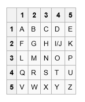

# misc 2 上古神器

## 题目描述
---
```
第二层虚数空间是上古之神密神守护，密神精通各类法器加密解密珠算之法更是出神入化。

华夜十分客气对密神道：在下是天族太子华夜。赴诸神之战，还请上神行个方便，让在下通过这第二层虚数空间

密神听了华夜的话之后，十分激动：如果你要通过第二层虚数空间，没有问题，但是你需要帮助我将这个波斯传来的“波利比奥斯棋盘”上的秘密解决掉 

华夜拿到该棋盘，只见棋盘盒上分布着一串十分奇异的数字：

“3534315412244543_434145114215_132435231542”

华夜微微思量，只见他大袖一会，手上立马变出一个计算器，瘦削的指尖快速的点击

一万年之后。。。

华夜通过他神力，终于揭开了棋盘山的秘密。。

密神见之十分欣喜，望着月亮升起的地方忧伤的道：实不相瞒，我守护者这第二层虚数空间已经上万年，在这期间无数人想要通过第二层的虚数空间，但都无功而返。不是我为难他们，而是通往第三层虚数空间的法诀就是这棋盘的秘密。

多少年来无人成功。太子你年纪轻轻就有如此神力，实在是后生可畏。

tips：比赛已结束，无红包活动

flag格式：flag{****}  全为小写字符串
```

## 题目来源
---
“百度杯”CTF比赛 2017 二月场

## 主要知识点
---
波利比奥斯棋盘加密

## 题目分值
---
10

## 部署方式
---


## 解题思路
---



3534315412244543_434145114215_132435231542
35 34 31 54 12 24 45 43_43 41 45 11 42 15_13 24 35 23 15 42
可以得到
POLYBI/JUS_SQUARE_CI/JPHER

polybius_square_cipher

## 参考
---
