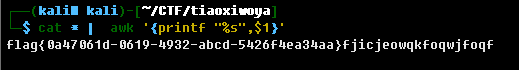

# misc1-纵横四海

## 题目描述
---
```
有句话说的好

（大表姐最美）

天下分久必合，合久必分
```

## 题目来源
---
“百度杯”CTF比赛 十二月场

## 主要知识点
---


## 题目分值
---
10

## 部署方式
---


## 解题思路
---

解压附件执行下列命令 

`cat * |  awk '{printf "%s",$1}'`



flag{0a47061d-0619-4932-abcd-5426f4ea34aa}fjicjeowqkfoqwjfoqf

## 参考
---
