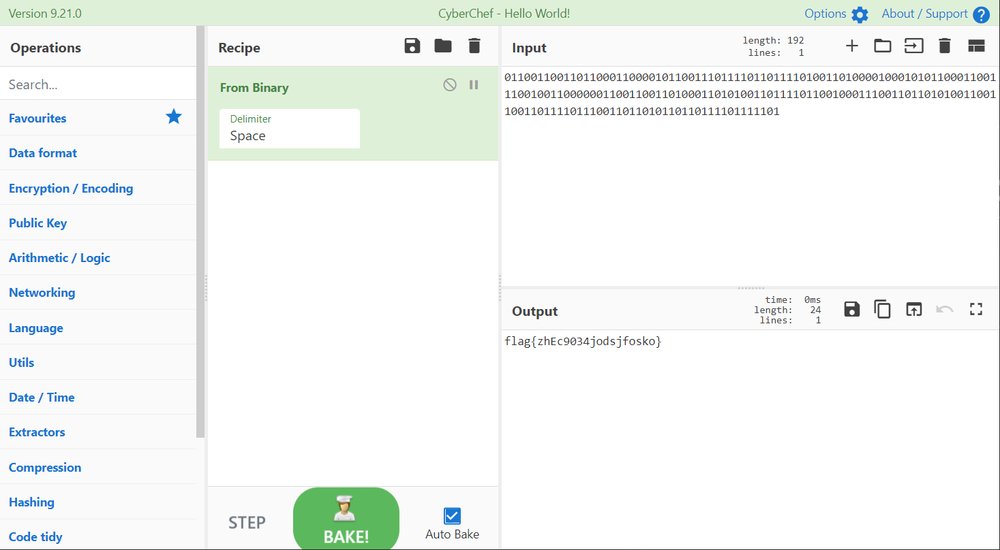

# misc2-对错

## 题目描述
---
```
如果说1代表对，0代表错，那么-1代表？
```

## 题目来源
---
“百度杯”CTF比赛 十二月场

## 主要知识点
---
bit to string

## 题目分值
---
10

## 部署方式
---


## 解题思路
---

题目给出的内容如下

```
011001100110110001100001011001110111101101111010011010000100010101100011001110010011000000110011001101000110101001101111011001000111001101101010011001100110111101110011011010110110111101111101
```

猜测按照8b进行分割，得到字符串`flag{zhEc9034jodsjfosko}`



## 参考
---
