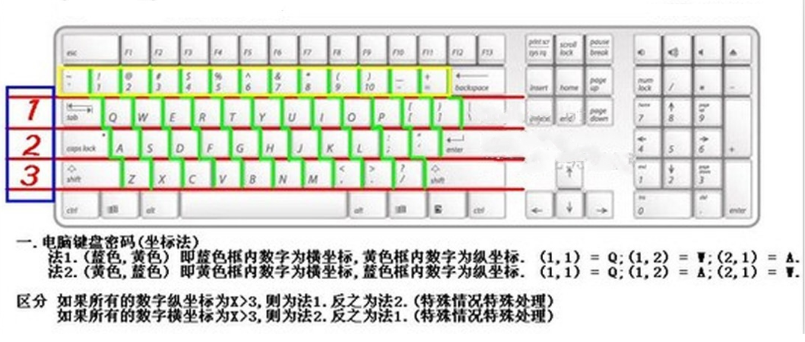

# misc3

## 题目描述
---
```
哒哒哒哒，你知道什么是键盘坐标密码吗？

11 21 31 18 27 33 34

flag格式：flag{*****}
```

## 题目来源
---
“百度杯”CTF比赛 十二月场

## 主要知识点
---
键盘密码

## 题目分值
---
10

## 部署方式
---


## 解题思路
---

键盘密码表如下



则可以得到字符串`QAZIJCV`

flag{QAZIJCV}

## 参考
---
