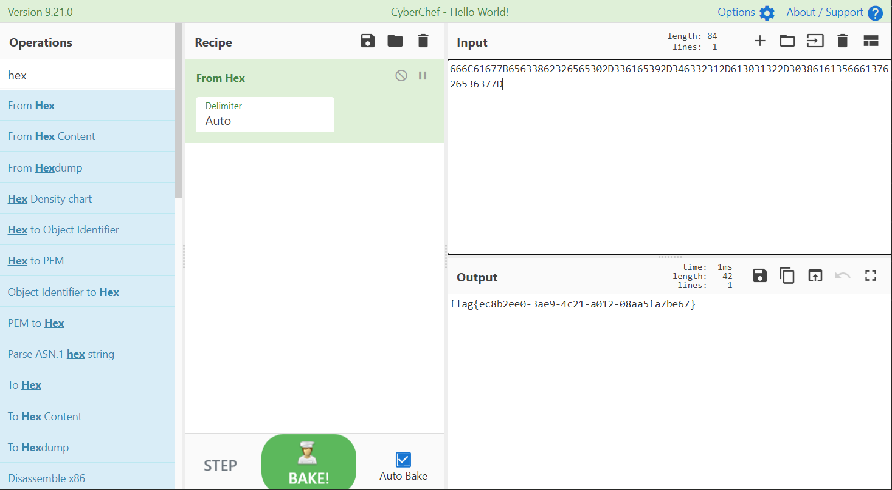

# 一个16岁的少年

## 题目描述
---
```
有一天，表姐的好朋友贝丝远房的表亲，一个16岁的少年

给表姐递了一封情书，表姐看不懂，你能帮忙翻译下吗？

666C61677B65633862326565302D336165392D346332312D613031322D3038616135666137626536377D
```

## 题目来源
---
“百度杯”CTF比赛 十二月场

## 主要知识点
---
编码转换

## 题目分值
---
10

## 部署方式
---


## 解题思路
---


flag{ec8b2ee0-3ae9-4c21-a012-08aa5fa7be67}

## 参考
---
