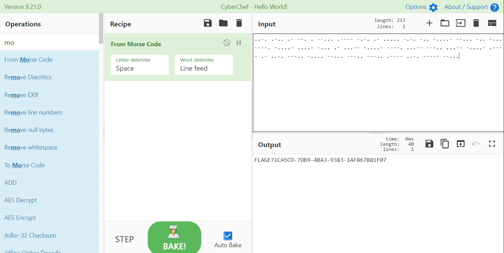

# 嘀嘀嘀

## 题目描述
---
```
..-. .-.. .- --. . --... .---- -.-. .- ..... -.-. -.. -....- --... -.. -... ----. -....- ....- -... .- ...-- -....- ----. ...-- ---.. ...-- -....- .---- .- ..-. ---.. -.... --... ---.. ---.. .---- ..-. ----- --...
```

## 题目来源
---
“百度杯”CTF比赛 十一月场

## 主要知识点
---
摩斯密码

## 题目分值
---
10

## 部署方式
---



FLAGE71CA5CD-7DB9-4BA3-9383-1AF867881F07

## 解题思路
---


## 参考
---
