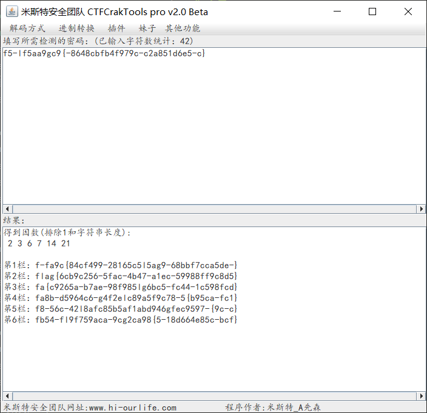

# 山岚

## 题目描述
---
```
f5-lf5aa9gc9{-8648cbfb4f979c-c2a851d6e5-c}
```

## 题目来源
---
“百度杯”CTF比赛 十一月场

## 主要知识点
---
栅栏

## 题目分值
---
10

## 部署方式
---


## 解题思路
---



flag{6cb9c256-5fac-4b47-a1ec-59988ff9c8d5}

## 参考
---
