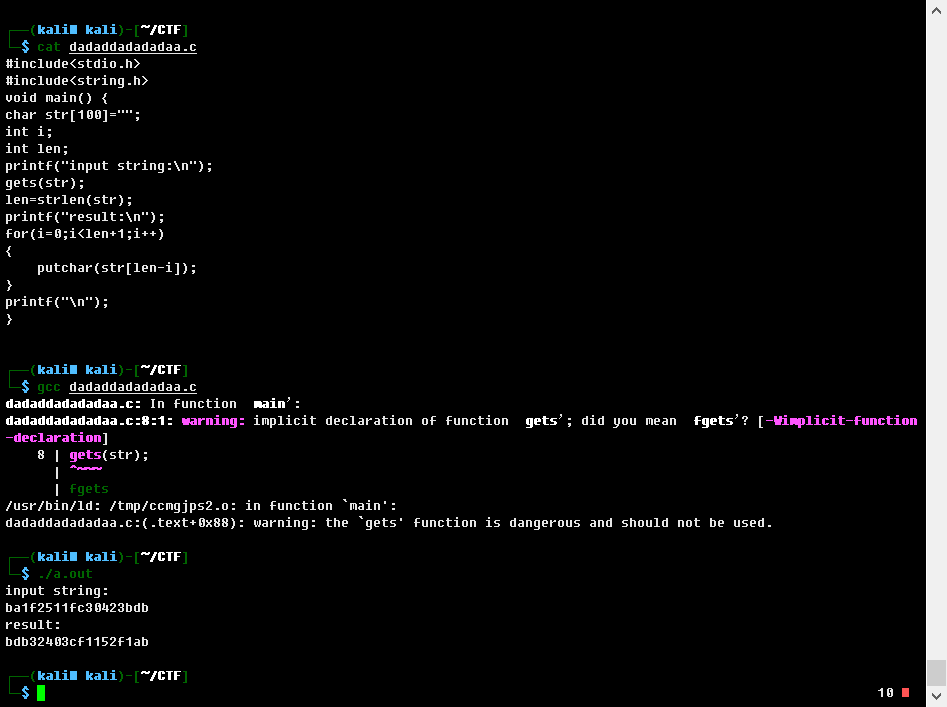

# 我要变成一只程序猿

## 题目描述
---
```
输入：ba1f2511fc30423bdb

再运行一下

就会有惊喜哦！！

点击下载附件
```

## 题目来源
---
“百度杯”CTF比赛 十月场

## 主要知识点
---
代码审计

## 题目分值
---
10

## 部署方式
---


## 解题思路
---
可以编译题目给出的程序执行，得到下面的结果



也可以查看代码,如下，代码含义：将输入的字符串做一个翻转（reverse）。

```c
#include<stdio.h>
#include<string.h>
void main() {
char str[100]="";
int i;
int len;
printf("input string:\n");
gets(str);
len=strlen(str);
printf("result:\n");
for(i=0;i<len+1;i++)
{
    putchar(str[len-i]);
}
printf("\n");
}
```

flag就是逆向后的字符串

bdb32403cf1152f1ab

## 参考
---
