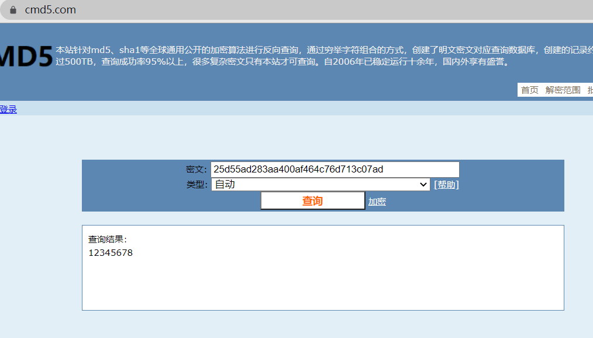

# 泄露的数据

## 题目描述
---
```
听说这是某个数据库的泄漏的重要数据

25d55ad283aa400af464c76d713c07ad，试着找出原始key吧。

flag{key}
```

## 题目来源
---
“百度杯”CTF比赛 十月场

## 主要知识点
---
MD5爆破

## 题目分值
---
10

## 部署方式
---


## 解题思路
---

在 https://www.cmd5.com/ 进行md5破解




## 参考
---
