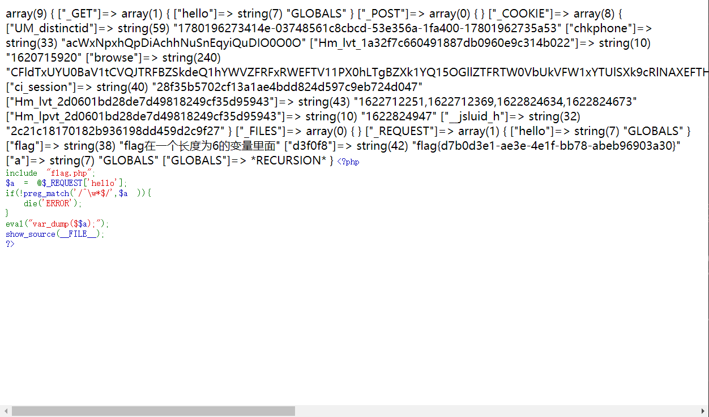

# 爆破-1

## 题目描述
---
```
flag就在某六位变量中。
```

## 题目来源
---
“百度杯”CTF比赛 2017 二月场

## 主要知识点
---


## 题目分值
---
10

## 部署方式
---


## 解题思路
---

打开页面后得到源码

```php
<?php
include "flag.php";
$a = @$_REQUEST['hello'];
if(!preg_match('/^\w*$/',$a )){
  die('ERROR');
}
eval("var_dump($$a);");
show_source(__FILE__);
?>
```

可以看到双重变量打印内容，使用`?hello=GLOBALS`可以打印所有的变量内容。



> 'GLOBALS', '_FILES', '_COOKIE', '_POST', '_GET'

## 参考
---
