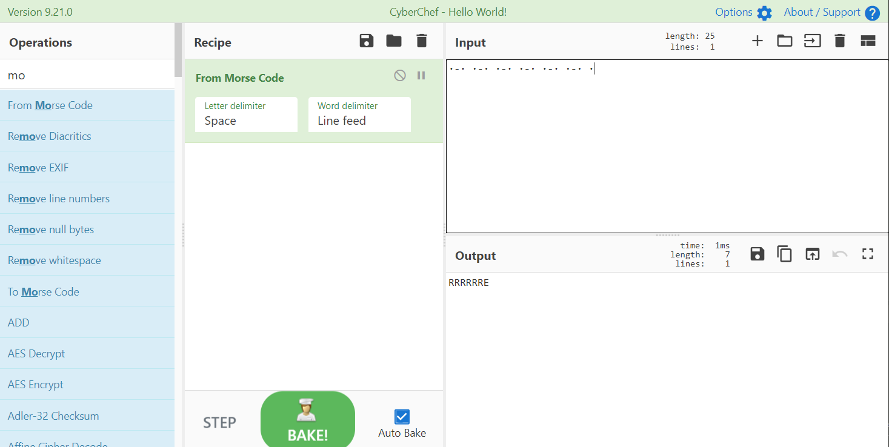

# 福尔摩斯

## 题目描述
---
```
贝克街旁的圆形广场

·-· ·-· ·-· ·-· ·-· ·-· ·

flag格式：flag{*********}
```

## 题目来源
---
“百度杯”CTF比赛 十二月场

## 主要知识点
---
摩斯密码

## 题目分值
---
10

## 部署方式
---


## 解题思路
---


flag{RRRRRRE}

## 参考
---
