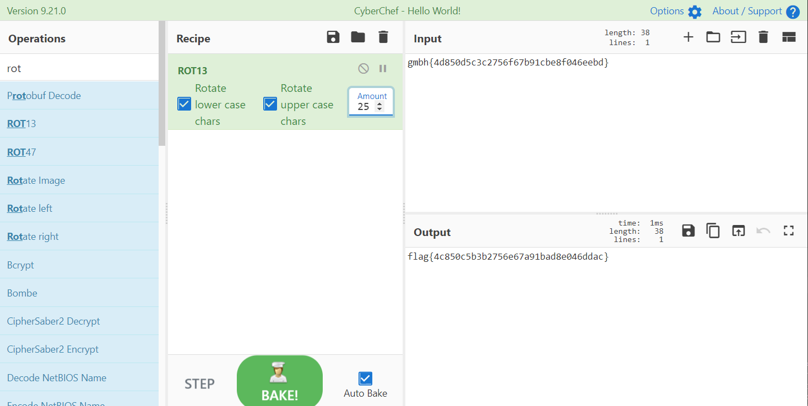

# 考眼力

## 题目描述
---
```
gmbh{4d850d5c3c2756f67b91cbe8f046eebd} 

try to find the flag
```

## 题目来源
---
“百度杯”CTF比赛 十月场

## 主要知识点
---
rot

## 题目分值
---
10

## 部署方式
---


## 解题思路
---



flag{4c850c5b3b2756e67a91bad8e046ddac}

## 参考
---
