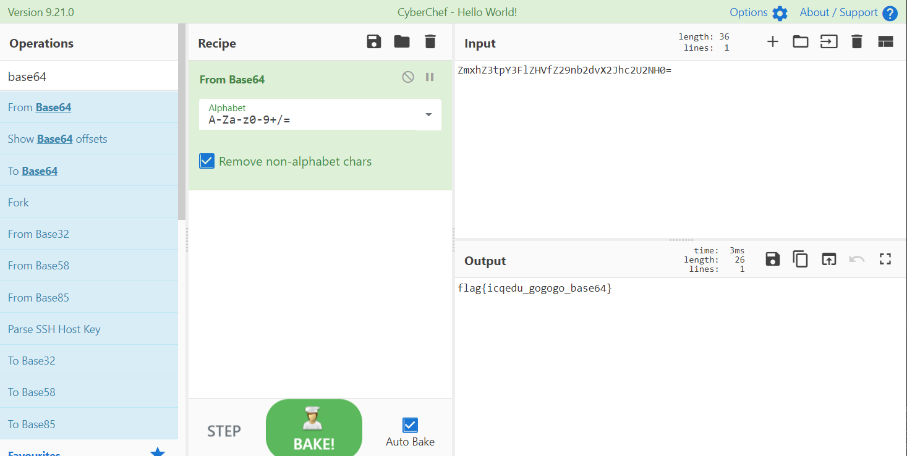

# 那些年我追过的贝丝

## 题目描述
---
```
贝丝贝丝，我爱你（大声循环2的6次方ing）

ZmxhZ3tpY3FlZHVfZ29nb2dvX2Jhc2U2NH0=
```

## 题目来源
---
“百度杯”CTF比赛 十月场

## 主要知识点
---
base64

## 题目分值
---
10

## 部署方式
---


## 解题思路
---



flag{icqedu_gogogo_base64}

## 参考
---
