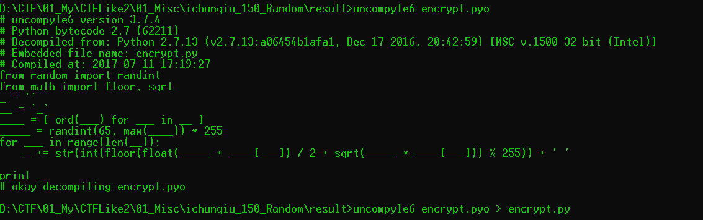

# Random

## 题目描述
---
```
答案加flag{}
```

## 题目来源
---
2017第二届广东省强网杯线上赛

## 主要知识点
---
解密

## 题目分值
---
150

## 部署方式
---


## 解题思路
---

使用`uncompyle6`对题目给出的`encrypt.pyo`进行反编译



得到

```python
# uncompyle6 version 3.7.4
# Python bytecode 2.7 (62211)
# Decompiled from: Python 2.7.13 (v2.7.13:a06454b1afa1, Dec 17 2016, 20:42:59) [MSC v.1500 32 bit (Intel)]
# Embedded file name: encrypt.py
# Compiled at: 2017-07-11 17:19:27
from random import randint
from math import floor, sqrt
_ = ''
__ = '_'
____ = [ ord(___) for ___ in __ ]
_____ = randint(65, max(____)) * 255
for ___ in range(len(__)):
    _ += str(int(floor(float(_____ + ____[___]) / 2 + sqrt(_____ * ____[___])) % 255)) + ' '

print _
# okay decompiling encrypt.pyo
```

题目给出的密文为

```
208 140 149 236 189 77 193 104 202 184 97 236 148 202 244 199 77 122 113 
```

所以只要按照加密方式写出对应的解密方法就可以得到明文了，首选判断random的值。判断原理为遍历所有的random值，然后需要题目给出的密文能够对应的找到对应的明文，只有这样的random才是有效的。

```python
def confirm_random_value():
    miwen = "208 140 149 236 189 77 193 104 202 184 97 236 148 202 244 199 77 122 113"
    miwen_ord_arr = miwen.split(" ")
    for n in xrange(65,127):  # n 为 random_value, 127的原因是明文的范围为可见字符，则最大为127，根据题目本身最小为65
        mingwen_right_count = 0
        for miwen_ord in miwen_ord_arr:  # 对每一个密文都要能够找到一个可见字符计算出来
            for x in xrange(33,128):  # 明文为可见字符，所以范围是33-128
                if int(floor(float(n*255 + x) / 2 + sqrt(n*255 * x)) % 255)==int(miwen_ord):  #
                    mingwen_right_count += 1
                    break
        if mingwen_right_count == len(miwen_ord_arr):  # 每个密文都能找到可见字符
            print n
```

得到random的值为`115`

然后在进行密文解密，也是使用暴力破解的方式

```python
def decrypt():
    miwen = "208 140 149 236 189 77 193 104 202 184 97 236 148 202 244 199 77 122 113"
    miwen_ord_arr = miwen.split(" ")
    random_value = 115
    mingwen_arr = []
    for miwen_ord in miwen_ord_arr:  # 对每一个密文都要能够找到一个可见字符计算出来
        for x in xrange(33,128):  # 明文为可见字符，所以范围是33-128
            if int(floor(float(random_value*255 + x) / 2 + sqrt(random_value*255 * x)) % 255)==int(miwen_ord):  #
                #print x, chr(x)
                if x > 65 and x < 127:
                    mingwen_arr.append(x)
        #print ""
    print "".join([chr(x) for x in mingwen_arr])
```

得到结果`ThisRandomIsNotSafe`。


## 参考
---
