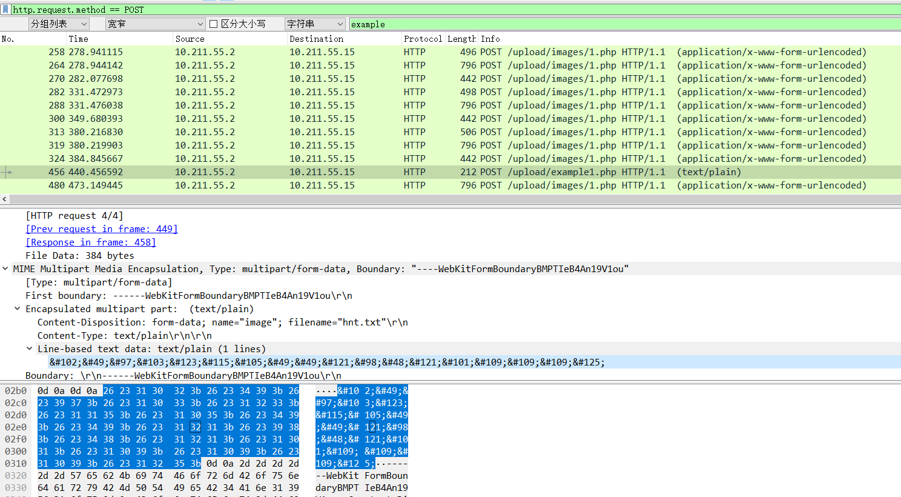
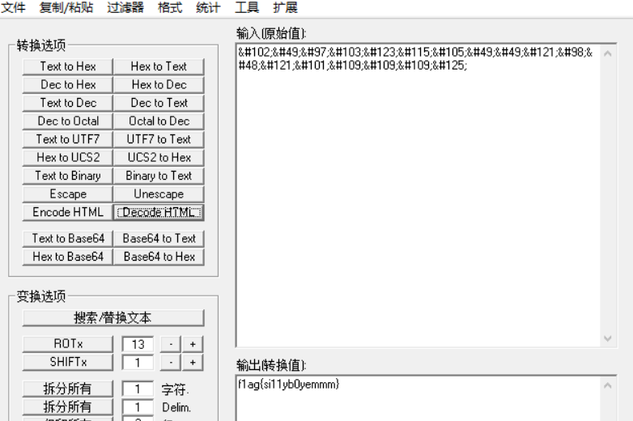

# 可恶的黑客

## 题目描述
---
```
flag格式为

flag{xxxxx}
```

## 题目来源
---
“迎圣诞，拿大奖”活动赛题

## 主要知识点
---


## 题目分值
---
150

## 部署方式
---


## 解题思路
---



```
&#102;&#49;&#97;&#103;&#123;&#115;&#105;&#49;&#49;&#121;&#98;&#48;&#121;&#101;&#109;&#109;&#109;&#125;
```

解码



f1ag{si11yb0yemmm}

## 参考
---
