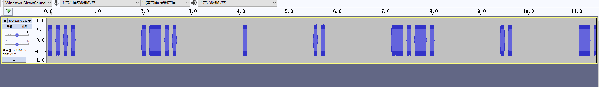

# 永不消逝的电波

## 题目描述
---
```
熟悉的电波在天空中回荡，一场没有硝烟的战争已经打响……

请收听“永不消逝的电波.mp3”


附件描述：

文件名：永不消逝的电波.mp3

文件大小：315769 字节

校验（SHA1）：AC5E7AEDBE85F289EEA8F308F89BB534710B19F9
```

## 题目来源
---
2016全国大学生信息安全竞赛

## 主要知识点
---


## 题目分值
---
150

## 部署方式
---


## 解题思路
---

使用`Audacity`加载MP3，发现存在摩斯电码的典型特征，进行测试



可以得到 

```
.... .-.. . .. -.-. .. -.-. - ... - .-- --- --- -.-. ..-. . -- -.-. -. .----
```

摩斯解码后

```
HLEICICTSTWOOCFEMCN1
```

再次使用栅栏解密


得到flag{HIWELCOMETOCISCNCTF1}

不得不说这个flag有点抽象

## 参考
---
