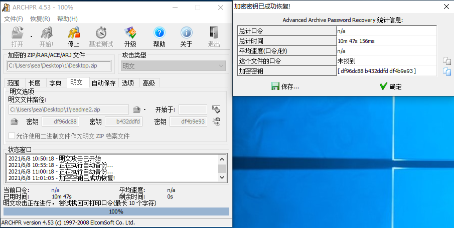

# 爆破？

## 题目描述
---
```
工兵手准备，ready go！！！
```

## 题目来源
---
2015广州强网杯

## 主要知识点
---


## 题目分值
---
150

## 部署方式
---


## 解题思路
---


./pkcrack -c readme.txt -p readme.txt -C Desktop.zip -P readme.zip -d ok.zip

多次尝试均不能成功明文攻击

最后发现是因为题目给出的`Desktop.zip`文件需要使用360压缩的对应明文文件才能够进行明文攻击，应该是使用的压缩算法有一定区别，没有在仔细研究。



在压缩包中找到flag  flag{7ip_Fi13_S0m3tim3s_s0_3a5y@}

## 参考
---
