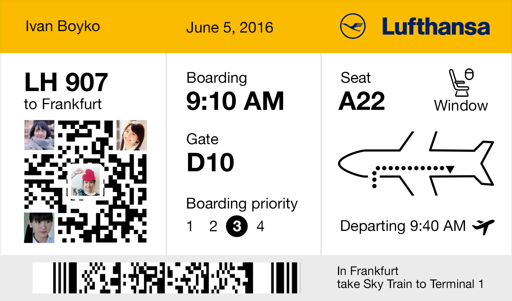
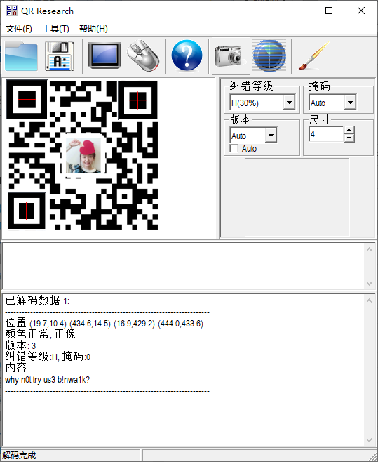
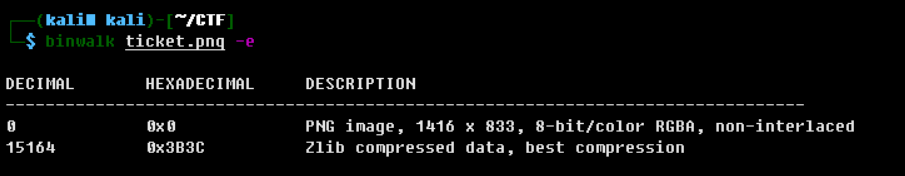
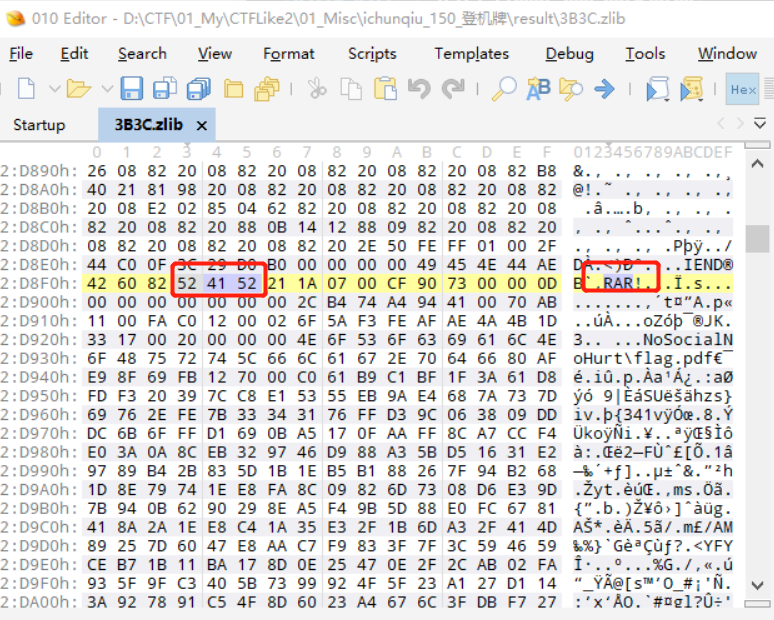
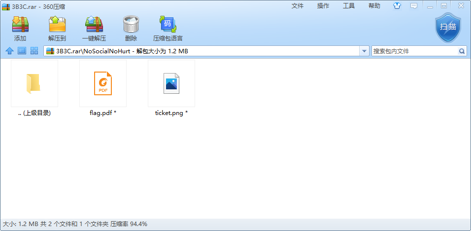
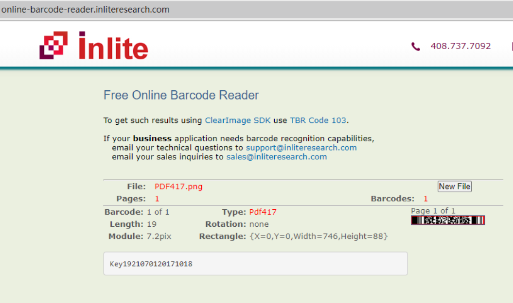

# 题目名称

## 题目描述
---
```
大家好，给大家介绍一下，这是我的登机牌。
```


## 题目来源
---
第三届上海市大学生网络安全大赛

## 主要知识点
---


## 题目分值
---


## 部署方式
---


## 解题思路
---

将二维码进行补全



提示使用binwalk进行文件分离



发现分离出的文件`3B3C.zlib`中存在Rar文件


再次进行分离，提取rar，并修改rar头为正确格式，发现存在密码



将题目给出题目的条形码反色，并在https://online-barcode-reader.inliteresearch.com/页面进行解码，该码为PDF417码。



压缩包密码1921070120171018

解压后在pdf文件中找到flag

flag{Car3_Y0ur_Secret}

## 参考
---
