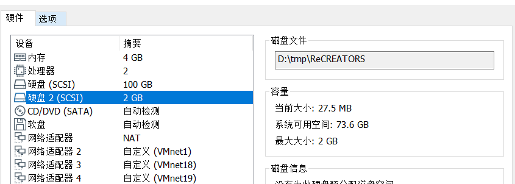
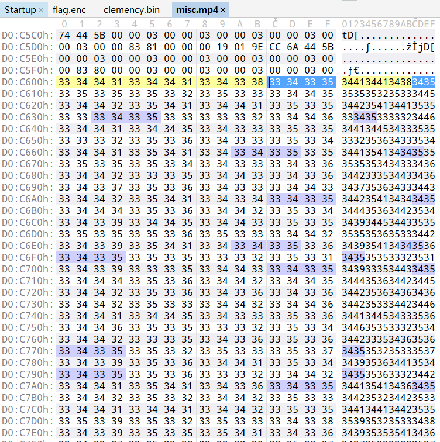

# ReCreators

## 题目描述
---
```

```

## 题目来源
---
i春秋 第二届春秋欢乐赛

## 主要知识点
---


## 题目分值
---
200

## 部署方式
---


## 解题思路
---

解压附件后发现文件是vm的虚拟磁盘


挂载进入虚机



发现存在一个`misc.mp4`文件，打开是一个不知道什么动漫


在mp4文件中发现了大量hex值



考出来进行解码

```
3441344134383435353535323533344534423541344135353334353333323446344134453433353533323536343335343441354134343535353535343433343634423335344334363437353634333443344235413434343534443536344235343439344534433535353535363533344234393541343435363435353533323531343933353443343534443536344234453442353634363436344235333442344634413445343335363446353533323534344233353436353634353532353335373439353634413534343535363332344234413541343634353442353234423533344134413442353535393532353334383439353535413436343735333332353734413532343434353539353234423534344135353541343534393533354135363439353634433436344235353532353334423335343634353334353334333536344233353441343634373534343334443441344134343436344235343442353334413445344235353446353335333444344235363441353634463535333234443441353234323435353335363533344534423444354134363531353335333446343935413433353634423535353235333441353234343535353535343533343734413536344135353537353633323442344234413433343534423535333235363441344534423435353735343533343734423541344235363435353133323438344134453443343535333536343334363442354134363535333635333332344234393541343335353332353634333443344235363436343533343532343334363441333534433436343735373533344334433441343434363444353434423532343734413435343535353533344135333442353634443536343535333332344434393335343535363535353635333534344234443541343634373533353335373439353634333535343735363533344234423445343635353535353334333436343734413437353634373536353334423442354134373435343935323442353834413445343934353533353335333436343935413437353634393533333235343441344534383435344435363442353434423541344135353539353334413536344135363443343535373536344135333443343234363435353535343433343634393335344334353437353634333443344334413434343634443534333235353439344534323535353935323533343434423532343735363444353533323535344134363445343534393536344234363441353535413436344635333533343734393335344235353446353634413533344135323436343635353532353334363441344534413534343535343332344234413541343334363442353633323534344234453437343535333536353334383442354134353535333234443533343834413441344534353535353234423538344233353432353634393533333233323439344534333536353335353541353334413445343634363435353133323535343935363442353634373536343334423441354134343436344435343442353534393445343435353537353234413533343935363434353634423531333234443441353234363435343535363533353034423541344534363444353233323442344135323433353434393536344235343441344534353536353535333433353734413445344234353437353434423441343735363437343534423533344235333442344534363435353735373533343334423536343435363437353535333537344134453438343535393536353335343442353634413536343735333541353634393541344334353442353635323533343933353435353634443534343334373439333534423436343735343433344334423541343735363444353534423532343734413443353535373534353334453442353533323436344235353332344134413445344534353437353635333445344234453441353634353533353235353437344134423536344635353533343434393532343635363444353335333536343735413442343535373536333234423441354134363535344235363332353734423445343734353539353135333437344235413433353634333535333234383441343533323535333235363442354134423532343235353531353334423536344334413442353533323535333234423442344534343535353535343433353634423445344335363437353334333443344334413434343634423445343335353439344534413535353535343533344434393541343735363444353335333536344134453439353635353532353335303442344435413436344635333533344634413536343434353437353635333534343935323437343534443533343335363439353634423435343735323533343834413441343734353442353634423537344234453436343535393533353334373442354134373536343735333332353434413445343834353535353634423538344233353441353534393533333235333439344134423534343935363441353334423541343634363535353335333436344334363441343535373534353334433442344134343436344235343332353434413444354134353539353235333444343935353541343634443535333234353441344134383435344435323433344334423445344135353446353335333445344334413433343534463536333234343441353234363535353535343433353634413536344134353537353635333443344135413435343534423536333235373441344534453435353735353533343834423541343735363433344435333537344134413434343534443532344235323442343935413435353935323332344634393441344334353332353535323533343934453436343533343532343335373441333534433435353735363442344334413541343434353444353434423534343734413442353535333534344135333439353634433536344435353332344534413436343634353537353634423443344135413441353634463533333234463439353234423536343735363533353334423536343535363535353234423537344133353441343534373535353334423441343535413436344235363442353334423445343734353535353635333434343935413439353634373444353335383441344134433435344235323442343434423541343634363437353333323442343935413443343534373536333234433439353634363535333234453533353534373441343934353533353034393344
```

hex

```
4A4A48455552534E4B5A4A553453324F4A4E4355325643544A5A4455555443464B354C464756434C4B5A44454D564B54494E4C555556534B495A44564555325149354C454D564B4E4B5646464B534B4F4A4E43564F5532544B3546564552535749564A544556324B4A5A46454B524B534A4A4B555952534849555A46475332574A52444559524B544A555A4549535A5649564C464B5552534B354645345343564B354A464754434D4A4A44464B544B534A4E4B554F53534D4B564A564F55324D4A5242455356534E4B4D5A465153534F495A43564B5552534A524455555453474A564A555756324B4B4A43454B5532564A4E4B45575453474B5A4B56455132484A4E4C45535643464B5A46553653324B495A43553256434C4B564645345243464A354C464757534C4C4A44464D544B52474A454555534A534B564D564553324D49354556555653544B4D5A4647535357495643554756534B4B4E465555534346474A47564756534B4B5A474549524B584A4E494553535346495A4756495332544A4E48454D564B544B5A4A5559534A564A564C4557564A534C4246455554434649354C454756434C4C4A44464D543255494E4255595253444B5247564D5532554A464E4549564B464A555A464F53534749354B554F564A534A524646555253464A4E4A544554324B4A5A43464B5632544B4E4745535653484B5A4555324D53484A4A4E4555524B584B35425649533232494E435653555A534A4E46464551325549564B564756434B4A5A44464D544B55494E445557524A53495644564B51324D4A524645455653504B5A4E464D52324B4A52435449564B544A4E4556555343574A4E4B4547544B4A475647454B534B534B4E4645575753434B564456475553574A4E4845595653544B564A5647535A56495A4C454B565253493545564D54434749354B464754434C4B5A47564D554B52474A4C555754534E4B5532464B55324A4A4E4E454756534E4B4E4A5645535255474A4B564F555344495246564D535356475A4B455756324B4A5A46554B5632574B4E4745595153474B5A4356435532484A45325532564B5A4B52425551534B564C4A4B553255324B4B4E4455555443564B4E4C564753434C4C4A44464B4E4355494E4A555554534D495A47564D5353564A4E4956555253504B4D5A464F53534F4A56444547565354495247454D53435649564B45475253484A4A47454B564B574B4E4645595353474B5A4756475332544A4E484555564B584B354A5549533253494A4B5449564A534B5A4646555353464C464A455754534C4B4A44464B5432544A4D5A455952534D49555A464D5532454A4A48454D52434C4B4E4A554F53534E4C4A43454F5632444A524655555443564A564A455756534C4A5A45454B5632574A4E4E45575553484B5A4756434D53574A4A44454D524B524B495A455952324F494A4C4532555253494E4645345243574A354C4557564B4C4A5A44454D544B54474A4B5553544A5349564C564D55324E4A46464557564B4C4A5A4A564F53324F49524B56475653534B56455655524B574A354A454755534B4A455A464B564B534B4E474555565344495A4956474D53584A4A4C454B524B444B5A46464753324B495A4C454756324C49564655324E5355474A49455350493D
```

hex

```
JJHEURSNKZJU4S2OJNCU2VCTJZDUUTCFK5LFGVCLKZDEMVKTINLUUVSKIZDVEU2QI5LEMVKNKVFFKSKOJNCVOU2TK5FVERSWIVJTEV2KJZFEKRKSJJKUYRSHIUZFGS2WJRDEYRKTJUZEISZVIVLFKURSK5FE4SCVK5JFGTCMJJDFKTKSJNKUOSSMKVJVOU2MJRBESVSNKMZFQSSOIZCVKURSJRDUUTSGJVJUWV2KKJCEKU2VJNKEWTSGKZKVEQ2HJNLESVCFKZFU6S2KIZCU2VCLKVFE4RCFJ5LFGWSLLJDFMTKRGJEEUSJSKVMVES2MI5EVUVSTKMZFGSSWIVCUGVSKKNFUUSCFGJGVGVSKKZGEIRKXJNIESSSFIZGVIS2TJNHEMVKTKZJUYSJVJVLEWVJSLBFEUTCFI5LEGVCLLJDFMT2UINBUYRSDKRGVMU2UJFNEIVKFJUZFOSSGI5KUOVJSJRFFURSFJNJTET2KJZCFKV2TKNGESVSHKZEU2MSHJJNEURKXK5BVIS22INCVSUZSJNFFEQ2UIVKVGVCKJZDFMTKUINDUWRJSIVDVKQ2MJRFEEVSPKZNFMR2KJRCTIVKTJNEVUSCWJNKEGTKJGVGEKSKSKNFEWWSCKVDVGUSWJNHEYVSTKVJVGSZVIZLEKVRSI5EVMTCGI5KFGTCLKZGVMUKRGJLUWTSNKU2FKU2JJNNEGVSNKNJVESRUGJKVOUSDIRFVMSSVGZKEWV2KJZFUKV2WKNGEYQSGKZCVCU2HJE2U2VKZKRBUQSKVLJKU2U2KKNDUUTCVKNLVGSCLLJDFKNCUINJUUTSMIZGVMSSVJNIVURSPKMZFOSSOJVDEGVSTIRGEMSCVIVKEGRSHJJGEKVKWKNFEYSSGKZGVGS2TJNHEUVKXK5JUIS2SIJKTIVJSKZFFUSSFLFJEWTSLKJDFKT2TJMZEYRSMIUZFMU2EJJHEMRCLKNJUOSSNLJCEOV2DJRFUUTCVJVJEWVSLJZEEKV2WJNNEWUSHKZGVCMSWJJDEMRKRKIZEYR2OIJLE2URSINFE4RCWJ5LEWVKLJZDEMTKTGJKUSTJSIVLVMU2NJFFEWVKLJZJVOS2OIRKVGVSSKVEVURKWJ5JEGUSKJEZFKVKSKNGEUVSDIZIVGMSXJJLEKRKDKZFFGS2KIZLEGV2LIVFU2NSUGJIESPI=
```

base32

```
JNJFMVSNKNKEMTSNGJLEWVSTKVFFUSCWJVJFGRSPGVFUMUJUINKEWSSWKRFVES2WJNJEERJULFGE2SKVLFLESM2DK5EVUR2WJNHUWRSLLJFUMRKUGJLUSWSLLBIVMS2XJNFEUR2LGJNFMSKWJRDESUKTKNFVURCGKVITEVKOKJFEMTKUJNDEOVSZKZFVMQ2HJI2UYRKLGIZVSS2SJVEECVJSKJHE2MSVJVLDEWKPIJEFMTKSKNFUSVSLI5MVKU2XJJLEGVCTKZFVOTCCLFCTMVSTIZDUEM2WJFGUGU2LJZFEKS2OJNDUWSSLIVGVIM2GJZJEWWCTKZCEYS2KJRCTEUSTJNFVMTCGKE2EGUCLLJBVOVZVGJLE4USKIZHVKTCMI5LEIRSJKZBUGSRVKNLVSUSSK5FVEV2GIVLFGTSLKVMVQQ2WKNMU4USIKZCVMSSRJ42UWRCDKVJU6TKWJNKEWVSLLBFVEQSGI5MUYTCHIUZUMSJSGJLUSWSHKZFU4TCSJNLFMVJUKQZFOS2WJNMFCVSDLFHUETCFGJLEUVSJLJFVMSKSKNJUWWSDKRBU4U2VJZJEYRKNKRFUOSK2LFLE2VSDJNFDKSSGJMZDGWCLKJLUMRKVKNHEWVKZKRGVMQ2VJFFEQR2LGNBVMR2CJNDVOVKUKNFFMS2UIM2EWVSMIJKUKNSWKNDUSVRUIZEVORCRJI2UURSLJVCFQS2WJVEECVJSKJFVCWKEKM6T2PI=
```

base32

```
KRVVMSTFNM2VKVSUJZHVMRSFO5KFQ4CTKJVTKRKVKRBE4YLMIUYVI3CWIZGVKOKFKZKFET2WIZKXQVKWKJJGK2ZVIVLFIQSSKZDFUQ2UNRJFMTKFGVYVKVCGJ5LEK23YKRMHAU2RNM2UMV2YOBHVMRSKIVKGYUSWJVCTSVKWLBYE6VSFGB3VIMCSKNJEKNKGKJKEMT3FNRKXSVDLKJLE2RSKKVLFQ4CPKZCWW52VNRJFOULLGVDFIVCCJ5SWYRRWKRWFEVSNKUYXCVSYNRHVEVJQO5KDCUSOMVKTKVKXKRBFGYLLGE3FI22WIZGVKNLRKVVU4T2WKVKXQVCYOBLE2VJVIZKVIRSSKZCTCNSUNRLEMTKGIZYVMVCKJ5JFK23XKRWFEUSNKUYTMVCUIJHGK3CVGBKGWUTSJVKTC4KVLBUE6VSGIV4FIWDQJ5JFKMDXKVMHAU2RKQYDS
```

base32

```
TkVJek5UVTNOVFEwTXpSRk5EUTBNalE1TlVFMU9EVTROVFUxUVRRek5EVTBRVFZCTlRVME5qUTFOVEkxTXpSQk5FWXpOVFJETlRVME9UVXpOVE0wT0RSRE5FRTFOelUyTkRVMFJUVXpOVEkwUlRWQk5FTTBOelF6TlRVMU1qVXlORU0wT1RNeU5UWTBSak16TkVFMU5qUkNOVUUxTXpVMU5FUTFRVE16TlVFMFFqVTJORUkwTlRRMU16TTBNelU0TkRrMU1qUXhOVFExTXpORU0wUXpSQT09
```

base64

```
NEIzNTU3NTQ0MzRFNDQ0MjQ5NUE1ODU4NTU1QTQzNDU0QTVBNTU0NjQ1NTI1MzRBNEYzNTRDNTU0OTUzNTM0ODRDNEE1NzU2NDU0RTUzNTI0RTVBNEM0NzQzNTU1MjUyNEM0OTMyNTY0RjMzNEE1NjRCNUE1MzU1NEQ1QTMzNUE0QjU2NEI0NTQ1MzM0MzU4NDk1MjQxNTQ1MzNEM0QzRA==
```

base64

```
4B355754434E4442495A5858555A43454A5A55464552534A4F354C55495353484C4A5756454E53524E5A4C47435552524C4932564F334A564B5A53554D5A335A4B564B454533435849524154533D3D3D
```

hex

```
K5WTCNDBIZXXUZCEJZUFERSJO5LUISSHLJWVENSRNZLGCURRLI2VO3JVKZSUMZ3ZKVKEE3CXIRATS===
```

base32

```
Wm14aFozdDNhRFIwWDJGZmR6QnVaR1Z5Wm5VeFgyUTBlWDA9
```

base64

```
ZmxhZ3t3aDR0X2FfdzBuZGVyZnUxX2Q0eX0=
```

base64

```
flag{wh4t_a_w0nderfu1_d4y}
```

## 参考
---
