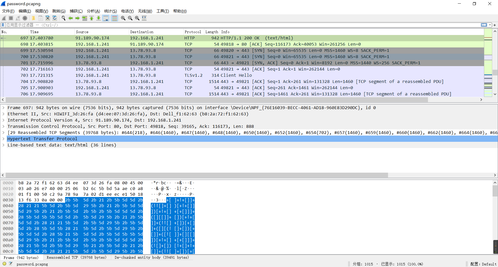
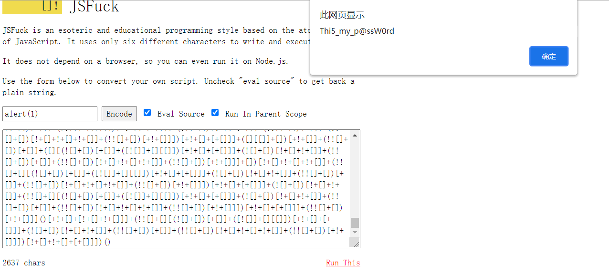
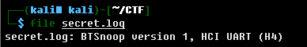
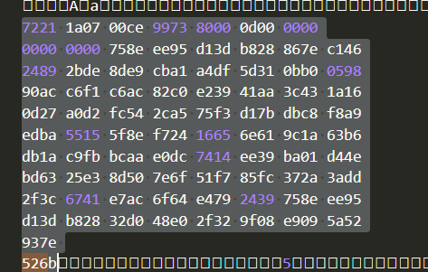
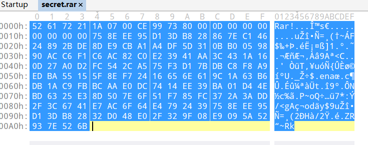
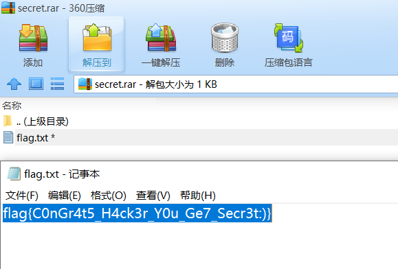

# 流量分析

## 题目描述
---
```
flag格式为

flag{xxxxx}
```

## 题目来源
---
“迎圣诞，拿大奖”活动赛题

## 主要知识点
---
流量分析 

## 题目分值
---
200

## 部署方式
---


## 解题思路
---

在流量中找到了一串jsfuck代码，



解码得到一个口令`Thi5_my_p@ssW0rd`



secret.log BTSnoop version

>调试Android上的BLE应用，有时需要用到btsnoop文件以检查手机端的蓝牙行为。理想情况下，手机端在开发者选项中打开蓝牙日志选项，即可生成btsnoop文件，但是不同的手机生成btsnoop文件的位置不同，难以查找，更甚者，许多手机完全关闭了这一功能。



一通分析无果，在secret.log中发现存在一些hex数据



将数据转为二进制文件，发现是一个rar文件。



打开正好是需要密码，密码就是前面在流量包里拿到的。



解压得到flag `flag{C0nGr4t5_H4ck3r_Y0u_Ge7_Secr3t:)}`

## 参考
---
