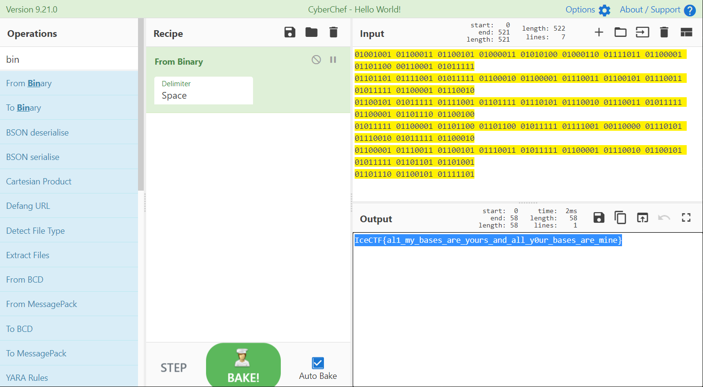

# All your Base are belong to us

## 题目描述
---
```
What a mess... we got a raw flag but now what do we do... flag.txt
```

## 题目来源
---
IceCTF

## 主要知识点
---


## 题目分值
---
20

## 部署方式
---


## 解题思路
---



IceCTF{al1_my_bases_are_yours_and_all_y0ur_bases_are_mine}

## 参考
---
