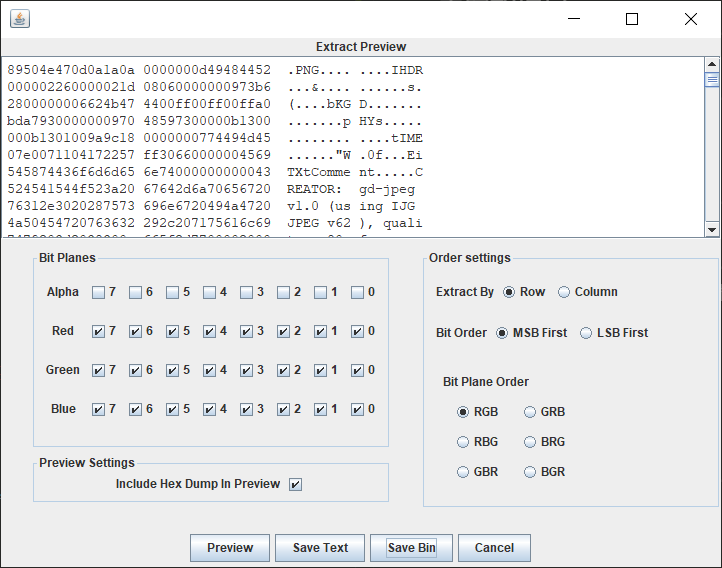
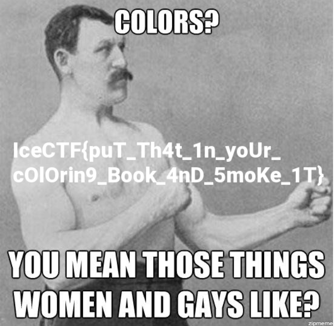

# Pretty Pixels

## 题目描述
---
```
Don't get me wrong, I love pretty colors as much as the next guy... 

but what does it mean? pretty_pixels.png
```

## 题目来源
---
IceCTF

## 主要知识点
---


## 题目分值
---
20

## 部署方式
---


## 解题思路
---

根据题目提示，给出的附件图片在像素级别应该存在错误。

使用`Stegsolve`打开文件，使用菜单栏Analyse中的Data Extract功能，勾选Red、Green、Blune



Preview，预览，可以在窗口中看到，典型的PNG头部，然后Save Bin保存为PNG图片，flag就在图片上



IceCTF{puT_Th4t_1n_yoUr_cOlOrin9_Book_4nD_5moKe_1T}

## 参考
---
