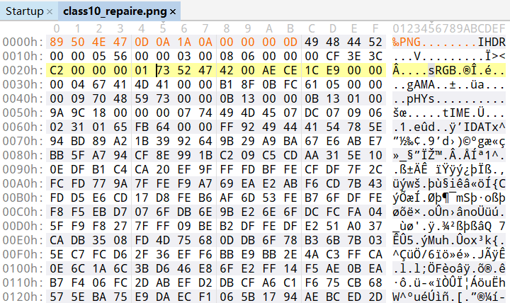
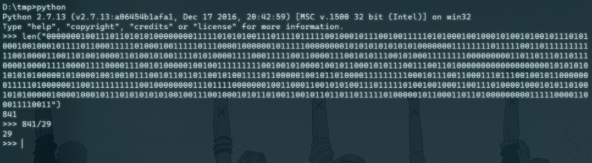
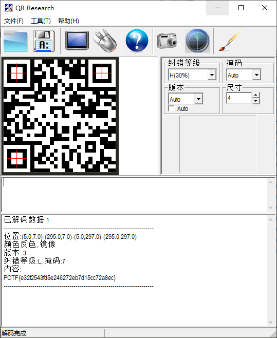

# Class10

## 题目描述
---
```
听说神盾局的网络被日穿之后，有人从里面挖出来一个神秘的文件咋一看也没什么，可是这可是class10保密等级的哦，里面一定暗藏玄机，你能发现其中暗藏的玄机吗？

文件：点击下载附件
```

## 题目来源
---
ISC2016训练赛——phrackCTF

## 主要知识点
---


## 题目分值
---


## 部署方式
---


## 解题思路
---

按照下图修复一下图片即可




PCTF{SHIELD_Class_10_C4n_You_find_the_fl4g!}

看flag内容就知道不对了，使用binwalk对文件进行分离，获得4个文件，其中有个一文件中全部为0,1字符，内容如下

```
0000000100111011010101000000001111101010100111011110111110010001011100100111110101000100100010100101001011101010001001000101111011000111110100010011111011100001000000101111100000000101010101010101000000011111111011111001101111111111100100001100110100100001101001010011110101000011110001111100110000111001010111001010001111111100000000011011011101101110000100001111000011110000111001010000010010011111111100100101000010010110001010111001110011010000000000000000000101010101010101000001010000100100101110010110110110010100111101100000100101101000011111111100010111001100011101110010010110000000111110100000011001111111111001000000001110111100000001001100011001010100111011111010010010001100111010000100010101101001010100000100001000101110101010101001001110010001010110100110010110110110111110100000101100011011010000000001111100001100011110011
```

计算一下长度，刚好841，是一个二维码的像素点大小(29*29)。



使用下面代码生成二维码

```python
#!/usr/bin/env python
# -*- coding: utf-8 -*-

"""
@Author : darkN0te
@Create date : 2021年6月8日08:26:10
@description : 通过01字符串生成二维码
@Update date :
"""
 
import PIL.Image as Image
import numpy as np

blackbit = '1'  # 字符串中黑色代表的字符
tmp_str = "0000000100111011010101000000001111101010100111011110111110010001011100100111110101000100100010100101001011101010001001000101111011000111110100010011111011100001000000101111100000000101010101010101000000011111111011111001101111111111100100001100110100100001101001010011110101000011110001111100110000111001010111001010001111111100000000011011011101101110000100001111000011110000111001010000010010011111111100100101000010010110001010111001110011010000000000000000000101010101010101000001010000100100101110010110110110010100111101100000100101101000011111111100010111001100011101110010010110000000111110100000011001111111111001000000001110111100000001001100011001010100111011111010010010001100111010000100010101101001010100000100001000101110101010101001001110010001010110100110010110110110111110100000101100011011010000000001111100001100011110011"

row_arr = [tmp_str[i:i+29] for i in range(0, len(tmp_str), 29)]
print row_arr, len(row_arr)
bwmat = [[0 if b==blackbit else 255 for b in row] for row in row_arr]  #用255表示白，0表示黑
print bwmat, len(bwmat)
imagesize = (290, 290)
img = Image.fromarray(np.uint8(np.array(bwmat)))
img.save("qrcode.png")
```

执行后获得二维码




PCTF{e32f2543fd5e246272eb7d15cc72a8ec}

## 参考
---
