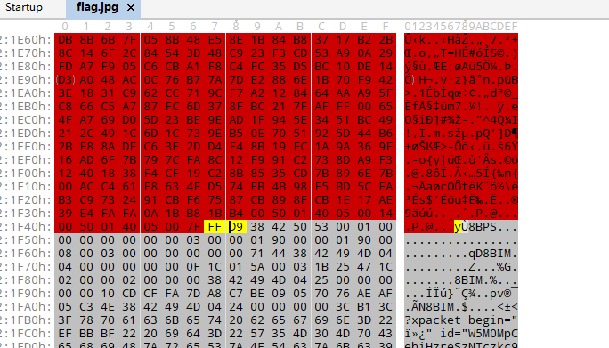

# CryMisc

## 题目描述
---
```

```

## 题目来源
---
i春秋 第二届春秋欢乐赛

## 主要知识点
---


## 题目分值
---
300

## 部署方式
---


## 解题思路
---

查看题目附件，给出了一个`jiami.py`和压缩包`crypto.zip`，压缩包有密码，并且包含了`jiami.py`，使用zip已知明文攻击解密。


得到`crypto.zip`压缩包的解密结果，其中包含了三个加密文件，进行解密分析


分析`AESencrypt.py`的源码，其中含义表示next.zip使用`key`进行了AES加密，`key`就是本题目需要求的，同时题目将`key`通过RSA加密后存在了文件`RSA.encrypt`中。

```python
# -*- coding:utf8 -*-
from Crypto.Cipher import AES

s=open('next.zip','rb').read()
BS=16
pad_len=BS-len(s)%BS
padding=chr(pad_len)*pad_len
s+=padding

key='我后来忘了'
n=0x48D6B5DAB6617F21B39AB2F7B14969A7337247CABB417B900AE1D986DB47D971
e=0x10001
m=long(key.encode('hex'),16)
c=pow(m,e,n)
c='0{:x}'.format(c).decode('hex')
with open('RSA.encrypt','wb') as f:
    f.write(c)

obj=AES.new(key,AES.MODE_ECB)
with open('AES.encryt','wb') as f:
    f.write(obj.encrypt(s))
```

所以思路就很清晰了，首先通过将`RSA.encrypt`中的`key`解密，然后在利用`key`去解密AES恢复`next.zip`

解密key时，首先要算出RAS的私钥(d,n)

首先使用yafu进行大数分解


得到结果

```
P39 = 185783328357334813222812664416930395483
P39 = 177334994338425644535647498913444186659
```

下面使用脚本进行`key`的求解

```python
#-*- coding: UTF-8 -*- 

import gmpy2
import binascii

q = 185783328357334813222812664416930395483
p = 177334994338425644535647498913444186659
e = 0x10001
n = 0x48D6B5DAB6617F21B39AB2F7B14969A7337247CABB417B900AE1D986DB47D971
d = gmpy2.invert(e, (p-1)*(q-1))
print d
# m = pow(c,d,n)

c_file = open("gogogo/RSA.encrypt", "rb")
c = binascii.hexlify(c_file.read())
c = int(c, 16)
m = gmpy2.powmod(c,d,n)
print m
print binascii.unhexlify(hex(m)[2:])
```


得到key为`copy__white__key`，使用AES解码将`next.zip`解密

```python
# -*- coding:utf8 -*-
from Crypto.Cipher import AES

key = "copy__white__key"

obj = AES.new(key,AES.MODE_ECB)
c_file = open("gogogo/AES.encryt", "rb")
zip_data = obj.decrypt(c_file.read())

with open('next.zip','wb') as f:
    f.write(zip_data)
```

打开该文件，发现有给了一个机密文件`encrypt.py`

```python
# -*- coding:utf8 -*-
from base64 import *

s=open('flag.jpg','rb').read()
s='-'.join(map(b16encode,list(s)))
# zip 得到两个元组，一个是每个字节的第一个16进制值组成的，一个是每个字节的第二个16进制值组成的
s=map(''.join,zip(*(s.split('-'))))
with open('first','wb') as f:
    f.write(b16decode(s[0]))
with open('second','wb') as f:
    f.write(b16decode(s[1]))
```

可以看到此加密将`flag.jpg`这张图片首先将每一个编码进行了b16encode，并且使用`-`连接这些字符，然后将每个字符分成两部分分别存储在连个文件中，所以写代码恢复文件

```python
#-*- coding: UTF-8 -*- 
from base64 import *


hecheng = []

first = open("next/first", "rb")
first_content = first.read()
second = open("next/second", "rb")
second_contnet = second.read()

# 获取16进制数据
s1 = ''.join(map(b16encode,list(first_content)))
s2 = ''.join(map(b16encode,list(second_contnet)))
str=""
for i in range(0,len(s1)):
    str += s1[i] + s2[i];
str = str.decode('hex')
with open(r'flag.jpg','wb') as f:
    f.write(str)
```

恢复得到图片


使用010editor查看图片发现在图片最后还存在一个psd文件



将`FFD9`后的数据抠出来保存，使用PS打开


在PS中将背景保存进新文件，然后导出为png格式图片。


使用`StegSolve`查看该图片，在`Gray Bits`页面发现一个二维码


扫描二维码得到flag


flag{409d7b1e-3932-11e7-b58c-6807154a58cf}

## 参考
---
